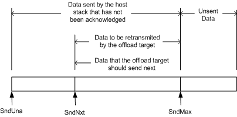

# Send Data That Contains Data to Be Retransmitted

\[The TCP chimney offload feature is deprecated and should not be used.\]

The following figure shows how the **SndUna**, **SndNxt**, and **SndMax** members of the [**TCP\_OFFLOAD\_STATE\_DELEGATED**](https://msdn.microsoft.com/library/windows/hardware/ff570939) structure segment send data that contains data to be retransmitted by the offload target.

The data from the byte that is indicated by **SndUna** up to the byte before the byte that is indicated by **SndNxt** is data that the host stack transmitted but for which the host stack did not receive an acknowledgment from the remote host. The offload target must process any acknowledgments for this data and retransmit the data later, if necessary.

The data from the byte that is indicated by **SndNxt** up to the byte that is indicated by **SndMax** is data that the offload target must send next on the TCP connection after the connection has been offloaded. This data is data that might have to be retransmitted. The offload target must send this data before sending any other data on the offloaded connection.

The data to the right of the byte that is indicated by **SndMax** is unsent data that the offload target must send after sending the data to be retransmitted.

 

 

