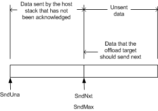

# Send Data That Does Not Contain Data to Be Retransmitted

\[The TCP chimney offload feature is deprecated and should not be used.\]

The following figure shows how the **SndUna**, **SndNxt**, and **SndMax** members of the [**TCP\_OFFLOAD\_STATE\_DELEGATED**](https://msdn.microsoft.com/library/windows/hardware/ff570939) structure segment send data that does not contain data to be retransmitted.

The data from the byte that is indicated by **SndUna** up to the byte before the byte that is indicated by **SndNxt** is data that the host stack transmitted but for which the host stack did not receive an acknowledgment from the remote host. The offload target must process any acknowledgments for this data and retransmit the data later, if necessary.

Because the send data does not contain any data to be retransmitted, the byte that is indicated by **SndNxt** equals the byte that is indicated by **SndMax**. The data to the right of the byte that is indicated by **SndNxt** and **SndMax** is unsent data that the offload target must send before sending any other data on the offloaded connection.

 

 

