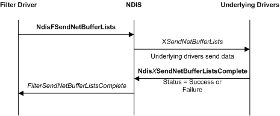
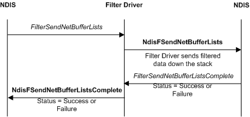

# Sending Data from a Filter Driver

Filter drivers can initiate send requests or filter send requests that overlying drivers initiate. When a protocol driver calls the [**NdisSendNetBufferLists**](/windows-hardware/drivers/ddi/ndis/nf-ndis-ndissendnetbufferlists) function, NDIS submits the specified [**NET\_BUFFER\_LIST**](/windows-hardware/drivers/ddi/nbl/ns-nbl-net_buffer_list) structure to the topmost filter module in the driver stack.

### Send Requests Initiated by a Filter Driver

The following figure illustrates a send operation that is initiated by a filter driver.

Filter drivers call the [**NdisFSendNetBufferLists**](/windows-hardware/drivers/ddi/ndis/nf-ndis-ndisfsendnetbufferlists) function to send the network data that is defined in a list of [**NET\_BUFFER\_LIST**](/windows-hardware/drivers/ddi/nbl/ns-nbl-net_buffer_list) structures.

A filter driver must set the **SourceHandle** member of each NET\_BUFFER\_LIST structure that it creates to the same value that it passes to the *NdisFilterHandle* parameter of **NdisFSendNetBufferLists**. NDIS drivers should not modify the **SourceHandle** member for NET\_BUFFER\_LIST structures that the driver did not originate.

Before calling **NdisFSendNetBufferLists**, a filter driver can set information that accompanies the send request with the [**NET\_BUFFER\_LIST\_INFO**](/windows-hardware/drivers/ddi/nblaccessors/nf-nblaccessors-net_buffer_list_info) macro. The underlying drivers can retrieve this information with the NET\_BUFFER\_LIST\_INFO macro.

As soon as a filter driver calls **NdisFSendNetBufferLists**, it relinquishes ownership of the NET\_BUFFER\_LIST structures and all associated resources. NDIS can handle the send request or pass the request to underlying drivers.

NDIS calls the [*FilterSendNetBufferListsComplete*](/windows-hardware/drivers/ddi/ndis/nc-ndis-filter_send_net_buffer_lists_complete) function to return the structures and data to the filter driver. NDIS can collect the structures and data from multiple send requests into a single linked list of NET\_BUFFER\_LIST structures before it passes the list to *FilterSendNetBufferListsComplete*

Until NDIS calls *FilterSendNetBufferListsComplete*, the current status of a send request is unknown. A filter driver should *never* try to examine the [**NET\_BUFFER\_LIST**](/windows-hardware/drivers/ddi/nbl/ns-nbl-net_buffer_list) structures or any associated data before NDIS returns the structures to *FilterSendNetBufferListsComplete*.

*FilterSendNetBufferListsComplete* performs whatever postprocessing is necessary to complete a send operation.

When NDIS calls *FilterSendNetBufferListsComplete*, the filter driver regains ownership of all the resources associated with the NET\_BUFFER\_LIST structures that are specified by the *NetBufferLists* parameter. *FilterSendNetBufferListsComplete* can either free these resources (for example, by calling the [**NdisFreeNetBuffer**](/windows-hardware/drivers/ddi/nblapi/nf-nblapi-ndisfreenetbuffer) and [**NdisFreeNetBufferList**](/windows-hardware/drivers/ddi/nblapi/nf-nblapi-ndisfreenetbufferlist) functions) or prepare them for reuse in a subsequent call to **NdisFSendNetBufferLists**.

NDIS always submits filter-supplied network data to the underlying drivers in the filter-driver-determined order as passed to **NdisFSendNetBufferLists**. However, after sending the data in the specified order, the underlying drivers can return the buffers in any order.

A filter driver can request loopback for send requests that it originates. To request loopback, the driver sets the NDIS\_SEND\_FLAGS\_CHECK\_FOR\_LOOPBACK flag in the *SendFlags* parameter of [**NdisFSendNetBufferLists**](/windows-hardware/drivers/ddi/ndis/nf-ndis-ndisfsendnetbufferlists). NDIS indicates a received packet that contains the send data.

**Note**  A filter driver should keep track of send requests that it originates and make sure that it does not call the [**NdisFSendNetBufferListsComplete**](/windows-hardware/drivers/ddi/ndis/nf-ndis-ndisfsendnetbufferlistscomplete) function when such requests are complete.

 

### Filtering Send Requests

The following figure illustrates filtering a send request that is initiated by an overlying driver.

NDIS calls a filter driver's [*FilterSendNetBufferLists*](/windows-hardware/drivers/ddi/ndis/nc-ndis-filter_send_net_buffer_lists) function to filter the send request of an overlying driver.

The filter driver must not modify the **SourceHandle** member in the NET\_BUFFER\_LIST structures that it receives from other drivers.

The filter driver can filter the data and send the filtered data to underlying drivers. For each NET\_BUFFER structure submitted to *FilterSendNetBufferLists*, a filter driver can do the following:

-   Pass the buffer on to the next underlying driver by calling the [**NdisFSendNetBufferLists**](/windows-hardware/drivers/ddi/ndis/nf-ndis-ndisfsendnetbufferlists) function. NDIS guarantees the availability of context space (see [NET\_BUFFER\_LIST\_CONTEXT structure](net-buffer-list-context-structure.md)) for filter drivers. The filter driver can modify the buffer contents before calling **NdisFSendNetBufferLists**. The processing of the filtered data proceeds as with a send operation initiated by a filter driver.

-   Drop the buffer by calling the [**NdisFSendNetBufferListsComplete**](/windows-hardware/drivers/ddi/ndis/nf-ndis-ndisfsendnetbufferlistscomplete) function.

-   Queue the buffer in a local data structure for later processing. The design of the filter driver dictates what causes the driver to process a queued buffer. Some examples include processing after a time-out or processing after a specific buffer is received.

    **Note**  If the driver queues send requests for later processing, it must support send cancellation requests. For more information about send cancellation requests, see [Canceling Send Requests in a Filter Driver](canceling-a-send-request-in-a-filter-driver.md).

     

-   Copy the buffer and originate a send request with the copy. The send operation is similar to a filter driver initiated send request. In this case, the driver must return the original buffer to the overlying driver by calling the [**NdisFSendNetBufferListsComplete**](/windows-hardware/drivers/ddi/ndis/nf-ndis-ndisfsendnetbufferlistscomplete) function.

Completion of send requests proceeds up the driver stack. When the miniport driver calls the [**NdisMSendNetBufferListsComplete**](/windows-hardware/drivers/ddi/ndis/nf-ndis-ndismsendnetbufferlistscomplete) function, NDIS calls the [*FilterSendNetBufferListsComplete*](/windows-hardware/drivers/ddi/ndis/nc-ndis-filter_send_net_buffer_lists_complete) function for the lowest overlying filter module.

After the send operation is complete, the filter driver reverses the modifications to the overlying driver's buffer descriptors that the filter driver made in *FilterSendNetBufferLists*. The driver calls the [**NdisFSendNetBufferListsComplete**](/windows-hardware/drivers/ddi/ndis/nf-ndis-ndisfsendnetbufferlistscomplete) function to return the linked list of NET\_BUFFER\_LIST structures to the overlying drivers and to return the final status of the send request.

When the topmost filter module calls **NdisFSendNetBufferListsComplete**, NDIS calls the originating protocol driver's [**ProtocolSendNetBufferListsComplete**](/windows-hardware/drivers/ddi/ndis/nc-ndis-protocol_send_net_buffer_lists_complete) function.

A filter driver that does not provide a *FilterSendNetBufferLists* function can still initiate a send request. If such a driver does initiate a send request, it must provide a *FilterSendNetBufferListsComplete* function and it must not pass the complete event up the driver stack.

A filter driver can pass on or filter the loopback request of an overlying driver. To pass on a loopback request, if NDIS set NDIS\_SEND\_FLAGS\_CHECK\_FOR\_LOOPBACK in the *SendFlags* parameter of *FilterSendNetBufferLists*, the filter driver sets NDIS\_SEND\_FLAGS\_CHECK\_FOR\_LOOPBACK in the *SendFlags* parameter when it calls **NdisFSendNetBufferLists**. NDIS indicates a received packet that contains the send data.

In general, if a filter driver modifies any behavior in such a way that NDIS cannot provide a standard service (such as loopback), the filter driver must provide that service for NDIS. For example, a filter driver that modifies a request for the hardware address (see [OID\_802\_3\_CURRENT\_ADDRESS](./oid-802-3-current-address.md)), should handle loopback of buffers directed to the new hardware address. In this case, NDIS cannot provide the loopback service it typically provides because the filter altered the address. Also, if the filter driver sets promiscuous mode (see [OID\_GEN\_CURRENT\_PACKET\_FILTER](./oid-gen-current-packet-filter.md)), it should not pass on the extra data that it receives to overlying drivers.

 

