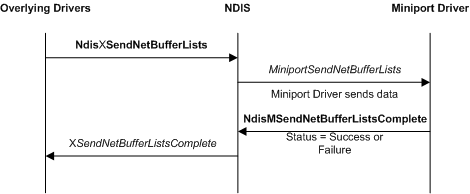

# Sending Data from a Miniport Driver

The following figure illustrates a miniport driver send operation.

NDIS calls a miniport driver's [*MiniportSendNetBufferLists*](https://msdn.microsoft.com/library/windows/hardware/ff559440) function to transmit the network data that is described by a linked list of [**NET\_BUFFER\_LIST**](https://msdn.microsoft.com/library/windows/hardware/ff568388) structures.

Miniport drivers call the [**NdisMSendNetBufferListsComplete**](https://msdn.microsoft.com/library/windows/hardware/ff563668) function to return a linked list of NET\_BUFFER\_LIST structures to an overlying driver and to return the final status of a send request.

 

 

