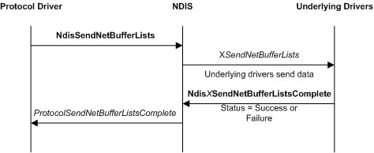

# Sending Data from a Protocol Driver

The following figure illustrates a protocol driver send operation, which involves a protocol driver, NDIS, and underlying drivers in a driver stack.

Protocol drivers call the [**NdisSendNetBufferLists**](https://msdn.microsoft.com/library/windows/hardware/ff564535) function to send the network data that is defined in a list of [**NET\_BUFFER\_LIST**](https://msdn.microsoft.com/library/windows/hardware/ff568388) structures.

A protocol driver must set the **SourceHandle** member of each NET\_BUFFER\_LIST structure to the same value that it passes to the *NdisBindingHandle* parameter. The binding handle provides the information that NDIS requires to return the NET\_BUFFER\_LIST structure to the protocol driver after the underlying miniport driver calls [**NdisMSendNetBufferListsComplete**](https://msdn.microsoft.com/library/windows/hardware/ff563668).

Before calling **NdisSendNetBufferLists**, a protocol driver can set information that accompanies the send request with the [**NET\_BUFFER\_LIST\_INFO**](https://msdn.microsoft.com/library/windows/hardware/ff568401) macro. The underlying drivers can retrieve this information with the NET\_BUFFER\_LIST\_INFO macro.

As soon as a protocol driver calls **NdisSendNetBufferLists**, it relinquishes ownership of the NET\_BUFFER\_LIST structures and all associated resources. NDIS calls the [**ProtocolSendNetBufferListsComplete**](https://msdn.microsoft.com/library/windows/hardware/ff570268) function to return the structures and data to the protocol driver. NDIS can collect the structures and data from multiple send requests into a single linked list of NET\_BUFFER\_LIST structures before it passes the list to *ProtocolSendNetBufferListsComplete*.

Until NDIS calls *ProtocolSendNetBufferListsComplete*, the current status of a protocol-driver-initiated send is unknown. A protocol driver temporarily releases ownership of all resources it allocated for a send request when it calls **NdisSendNetBufferLists**. A protocol driver should never attempt to examine the NET\_BUFFER\_LIST structures or any associated data before NDIS returns the structures to *ProtocolSendNetBufferListsComplete*.

*ProtocolSendNetBufferListsComplete* performs whatever postprocessing is necessary to complete a send operation. For example, the protocol driver can notify the clients, that requested the protocol driver to send the network data, that the send operation is complete.

When NDIS calls *ProtocolSendNetBufferListsComplete*, the protocol driver regains ownership of all of the resources associated with the NET\_BUFFER\_LIST structures that are specified by the *NetBufferLists* parameter. *ProtocolSendNetBufferListsComplete* can either free these resources (for example, by calling [**NdisFreeNetBuffer**](https://msdn.microsoft.com/library/windows/hardware/ff562582) and [**NdisFreeNetBufferList**](https://msdn.microsoft.com/library/windows/hardware/ff562583)) or prepare them for reuse in a subsequent call to **NdisSendNetBufferLists**.

Although NDIS always submits protocol-supplied network data to the underlying miniport driver in the protocol-determined order as passed to **NdisSendNetBufferLists**, the underlying driver can complete the send requests in random order. That is, every bound protocol driver can rely on NDIS to submit the network data that the protocol driver passes to **NdisSendNetBufferLists** in FIFO order to the underlying driver. However, no protocol driver can rely on the underlying driver to call **NdisMSendNetBufferListsComplete** in the same order.

 

 

