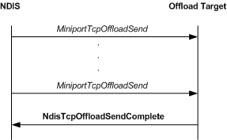

# Sending Data from an Offload Target

\[The TCP chimney offload feature is deprecated and should not be used.\]

The following figure shows the call sequence for a send operation that is performed by an offload target.

From the perspective of an offload target, a send operation is initiated when NDIS calls the offload target's [*MiniportTcpOffloadSend*](https://msdn.microsoft.com/library/windows/hardware/ff559464) function. An offload target always completes a send request asynchronously by calling [**NdisTcpOffloadSendComplete**](https://msdn.microsoft.com/library/windows/hardware/ff564609). To improve system performance, an offload target can create a linked list that contains [**NET\_BUFFER\_LIST**](https://msdn.microsoft.com/library/windows/hardware/ff568388) structures from multiple calls to the *MiniportTcpOffloadSend* function. The driver can then pass such a linked list in a single call to the **NdisTcpOffloadSendComplete** function.

For more information about sending data from an offload target, see [*MiniportTcpOffloadSend*](https://msdn.microsoft.com/library/windows/hardware/ff559464). For more information about completing a send operation, see [**NdisTcpOffloadSendComplete**](https://msdn.microsoft.com/library/windows/hardware/ff564609).

### Generating IP Identification Values and IP Fragments

An offload target should not generate IP fragments when sending data. However, an offload target must supply an IP identification (IP ID) for each IPv4 datagram that it sends and for each transmitted IPv6 datagram that contains a fragment.

An offload target generates IP ID values from the upper half of the IPv4 IP ID space for IPv4 datagrams and from the upper half of the IPv6 IP fragment ID space for IPv6 datagrams. An offload target therefore generates IP ID values in the range of 0x8000 through 0xFFFF for IPv4 datagrams and 0x8000000 through 0xFFFFFFFF for IPv6 datagrams.

The lower half of the IPv4 IP ID space and the lower half of the IPv6 fragment ID space are reserved for use by the host stack.

**Note**  An offload target should always set the Don't Fragment (DF) flag in the IP header of an IPv4 datagram that is to be sent.

 

 

 

