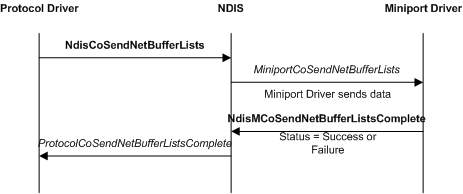

# Sending NET\_BUFFER Structures from CoNDIS Drivers

The following figure illustrates a basic CoNDIS send operation, which involves a protocol driver, NDIS, and a miniport driver.

As the preceding figure shows, protocol drivers call the [**NdisCoSendNetBufferLists**](https://msdn.microsoft.com/library/windows/hardware/ff561728) function to send [**NET\_BUFFER\_LIST**](https://msdn.microsoft.com/library/windows/hardware/ff568388) structures on a virtual connection (VC). NDIS then calls the miniport driver's [**MiniportCoSendNetBufferLists**](https://msdn.microsoft.com/library/windows/hardware/ff559365) function to forward the NET\_BUFFER\_LIST structures to an underlying miniport driver.

All NET\_BUFFER-based send operations are asynchronous. Therefore, the miniport driver always calls the [**NdisMCoSendNetBufferListsComplete**](https://msdn.microsoft.com/library/windows/hardware/ff563570) function and provides an appropriate status code when it is done sending the data. The miniport driver can complete the send operation for each NET\_BUFFER\_LIST structure independent of other NET\_BUFFER\_LIST structures. NDIS calls the protocol driver's [**ProtocolCoSendNetBufferListsComplete**](https://msdn.microsoft.com/library/windows/hardware/ff570257) function each time the miniport driver calls **NdisMCoSendNetBufferListsComplete**.

Protocol drivers can reclaim the ownership of the [**NET\_BUFFER\_LIST**](https://msdn.microsoft.com/library/windows/hardware/ff568388) structures and all associated structures and data as soon as NDIS calls the protocol driver's *ProtocolCoSendNetBufferListsComplete* function.

The miniport driver or NDIS can return the NET\_BUFFER\_LIST structures in any order. But protocol drivers are guaranteed that the list of [**NET\_BUFFER**](https://msdn.microsoft.com/library/windows/hardware/ff568376) structures that are attached to each NET\_BUFFER\_LIST structure has not been modified.

Protocols drivers set the **SourceHandle** member in the [**NET\_BUFFER\_LIST**](https://msdn.microsoft.com/library/windows/hardware/ff568388) structure to the same value as the *NdisVcHandle* parameter of **NdisCoSendNetBufferLists**. NDIS uses the **SourceHandle** member to return the NET\_BUFFER\_LIST structures to the protocol driver that sent the NET\_BUFFER\_LIST structures.

Intermediate drivers also set the **SourceHandle** member in the NET\_BUFFER\_LIST structure to the *NdisVcHandle* value. If an intermediate driver forwards a send request, the driver must save the **SourceHandle** value that the overlying driver provided before it writes to the **SourceHandle** member. When NDIS returns a forwarded NET\_BUFFER\_LIST structure to the intermediate driver, the intermediate driver must restore the **SourceHandle** that it saved.

Protocol drivers can cancel send requests by using the same mechanisms as connectionless drivers. For more information about canceling send requests, see [Canceling a Send Operation](canceling-a-send-operation.md).

 

 

