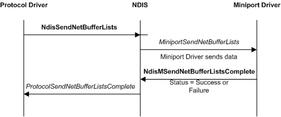

# Sending Network Data

The following figure illustrates a basic send operation, which involves a protocol driver, NDIS, and a miniport driver.

Protocol drivers call the [**NdisSendNetBufferLists**](/windows-hardware/drivers/ddi/ndis/nf-ndis-ndissendnetbufferlists) function to send [**NET\_BUFFER\_LIST**](/windows-hardware/drivers/ddi/nbl/ns-nbl-net_buffer_list) structures on a binding. NDIS calls the miniport driver's [*MiniportSendNetBufferLists*](/windows-hardware/drivers/ddi/ndis/nc-ndis-miniport_send_net_buffer_lists) function to forward the NET\_BUFFER\_LIST structures to an underlying miniport driver.

All NET\_BUFFER-based send operations are asynchronous. The miniport driver calls the [**NdisMSendNetBufferListsComplete**](/windows-hardware/drivers/ddi/ndis/nf-ndis-ndismsendnetbufferlistscomplete) function with an appropriate status code when it is done. The sending of each NET\_BUFFER\_LIST structure can be completed individually. NDIS calls the protocol driver's [**ProtocolSendNetBufferListsComplete**](/windows-hardware/drivers/ddi/ndis/nc-ndis-protocol_send_net_buffer_lists_complete) function each time the miniport driver calls **NdisMSendNetBufferListsComplete**.

Protocol drivers can reclaim the ownership of the NET\_BUFFER\_LIST structures and all associated structures and data as soon as the NDIS calls the protocol driver's *ProtocolSendNetBufferListsComplete* function.

The miniport driver or NDIS can return the [**NET\_BUFFER\_LIST**](/windows-hardware/drivers/ddi/nbl/ns-nbl-net_buffer_list) structures in any order. Protocol drivers are guaranteed that the list of [**NET\_BUFFER**](/windows-hardware/drivers/ddi/nbl/ns-nbl-net_buffer) structures attached to each NET\_BUFFER\_LIST structure has not been modified.

Any NDIS driver can separate the NET\_BUFFER structures in a NET\_BUFFER\_LIST structure. Any NDIS driver can also separate the MDLs in a NET\_BUFFER structure. However, the driver must always return the NET\_BUFFER\_LIST structures with the NET\_BUFFER structures and MDLs in the original form. For example, an intermediate driver might separate a NET\_BUFFER\_LIST into two new NET\_BUFFER\_LIST structures and pass on part of the original data to the next driver. However, when the intermediate driver completes the processing of the original NET\_BUFFER\_LIST it must return the complete NET\_BUFFER\_LIST with the original NET\_BUFFER structures and MDLs.

Protocol drivers set the **SourceHandle** member in the NET\_BUFFER\_LIST structure to the *NdisBindingHandle* that NDIS provided in a call to the [**NdisOpenAdapterEx**](/windows-hardware/drivers/ddi/ndis/nf-ndis-ndisopenadapterex) function. NDIS uses the **SourceHandle** member to return the NET\_BUFFER\_LIST structures to the protocol driver that sent the NET\_BUFFER\_LIST structures.

Intermediate drivers also set the **SourceHandle** member in the NET\_BUFFER\_LIST structure to the *NdisBindingHandle* value that NDIS provided in a call to **NdisOpenAdapterEx**. If an intermediate driver forwards a send request, the driver must save the **SourceHandle** value that the overlying driver provided before it writes to the **SourceHandle** member. When NDIS returns a forwarded NET\_BUFFER\_LIST structure to the intermediate driver, the intermediate driver must restore the **SourceHandle** that it saved.

 

