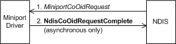

# Setting Information for a Connection-Oriented Miniport Driver

To set an OID that a connection-oriented miniport driver maintains, a bound protocol calls [**NdisCoOidRequest**](https://msdn.microsoft.com/library/windows/hardware/ff561711) and passes an [**NDIS\_OID\_REQUEST**](https://msdn.microsoft.com/library/windows/hardware/ff566710) structure that specifies the object (OID) that is being queried and that points to a buffer that contains the value to which the object should be set. The call to **NdisCoOidRequest** causes NDIS to call the miniport driver's [**MiniportCoOidRequest**](https://msdn.microsoft.com/library/windows/hardware/ff559362) function, which sets the object with the supplied value.

The call to **NdisCoOidRequest** can complete synchronously or asynchronously. To complete the call asynchronously, a miniport driver calls [**NdisCoOidRequestComplete**](https://msdn.microsoft.com/library/windows/hardware/ff561716). The following diagram illustrates setting information in a connection-oriented miniport driver.

 

 

