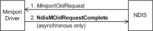

# Setting Information for a Connectionless Miniport Driver

To set an OID that a connectionless miniport driver maintains, a bound protocol calls [**NdisOidRequest**](https://msdn.microsoft.com/library/windows/hardware/ff563710) and passes an [**NDIS\_OID\_REQUEST**](https://msdn.microsoft.com/library/windows/hardware/ff566710) structure that specifies the object (OID) that is being queried and that points to a buffer that contains the value to which the object should be set. The call to **NdisOidRequest** causes NDIS to call the miniport driver's [*MiniportOidRequest*](https://msdn.microsoft.com/library/windows/hardware/ff559416) function, which sets the object with the supplied value.

The call to *MiniportOidRequest* can complete synchronously or asynchronously. To complete the call asynchronously, the miniport driver calls [**NdisMOidRequestComplete**](https://msdn.microsoft.com/library/windows/hardware/ff563622). The following diagram illustrates setting information in a connectionless miniport driver (per binding).

 

 

