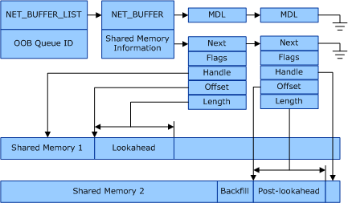

# Shared Memory in Receive Buffers

This section describes the layout of the shared memory in VMQ receive buffers.For more information about using the buffers in receive indications, see [VMQ Receive Path](vmq-receive-path.md).

If the overlying protocol driver set the NDIS\_RECEIVE\_QUEUE\_PARAMETERS\_LOOKAHEAD\_SPLIT\_REQUIRED flag in the **Flags** member of the [**NDIS\_RECEIVE\_QUEUE\_PARAMETERS**](https://msdn.microsoft.com/library/windows/hardware/ff567211) structure, the network adapter should split a received packet at an offset equal to or greater than the requested lookahead size and use DMA to transfer the lookahead data and the post-lookahead data to separate shared memory segments.

Miniport drivers specify the settings for the lookahead type (**NdisSharedMemoryUsageReceiveLookahead**) or other shared memory types when the shared memory is allocated. For example, the miniport driver calls the [**NdisAllocateSharedMemory**](https://msdn.microsoft.com/library/windows/hardware/ff561616) function and sets the **Usage** member in the [**NDIS\_SHARED\_MEMORY\_PARAMETERS**](https://msdn.microsoft.com/library/windows/hardware/ff567303) structure to **NdisSharedMemoryUsageReceiveLookahead**. Miniport drivers should allocated shared memory for a queue when the queue allocation is complete. For information about allocating and freeing shared memory resources for queues, see [Shared Memory Resource Allocation](shared-memory-resource-allocation.md).

The following illustration shows the relationships for the network data when the incoming data is split into two shared memory buffers.

The [**NET\_BUFFER\_SHARED\_MEMORY**](https://msdn.microsoft.com/library/windows/hardware/ff568419) structure specifies shared memory information. There can be a linked list of such shared memory buffers that are associated with a [**NET\_BUFFER**](https://msdn.microsoft.com/library/windows/hardware/ff568376) structure.

Use the [**NET\_BUFFER\_SHARED\_MEM\_NEXT\_SEGMENT**](https://msdn.microsoft.com/library/windows/hardware/ff568726), [**NET\_BUFFER\_SHARED\_MEM\_FLAGS**](https://msdn.microsoft.com/library/windows/hardware/ff568420), [**NET\_BUFFER\_SHARED\_MEM\_HANDLE**](https://msdn.microsoft.com/library/windows/hardware/ff568421), [**NET\_BUFFER\_SHARED\_MEM\_OFFSET**](https://msdn.microsoft.com/library/windows/hardware/ff568727), and [**NET\_BUFFER\_SHARED\_MEM\_LENGTH**](https://msdn.microsoft.com/library/windows/hardware/ff568725) macros to access the NET\_BUFFER\_SHARED\_MEMORY in a NET\_BUFFER structure. The **SharedMemoryInfo** member of the NET\_BUFFER structure contains the first NET\_BUFFER\_SHARED\_MEMORY structure in the linked list.

**Note**  Starting with NDIS 6.30, splitting packet data into separate lookahead buffers is no longer supported. Starting with Windows Server 2012, the overlying protocol driver will not set the **NDIS\_RECEIVE\_QUEUE\_PARAMETERS\_LOOKAHEAD\_SPLIT\_REQUIRED** flag in the **Flags** member of the [**NDIS\_RECEIVE\_QUEUE\_PARAMETERS**](https://msdn.microsoft.com/library/windows/hardware/ff567211) structure.

 

 

 

