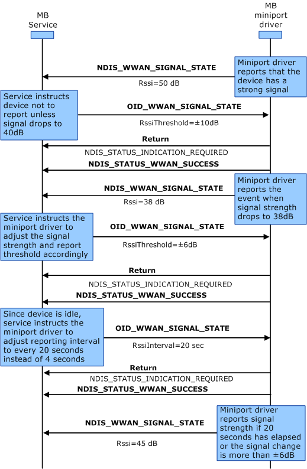

# Signal Strength Indication Semantics

The following diagram shows the process that miniport drivers should follow to process signal strength indications. The MB Service adjusts the signal strength-reporting threshold and interval, based on the current device signal strength and how long the device has been idle. These actions are usually performed as part of the power management features provided by the MB Service. The labels in bold are OID identifiers or transactional flow control, and the labels in regular text are the important flags within the OID structure.

To update signal strength indications, use the following procedure:

1.  The miniport driver sends [**NDIS\_WWAN\_SIGNAL\_STATE**](https://msdn.microsoft.com/library/windows/hardware/ff567931) to the MB Service.

2.  The MB Service sends [OID\_WWAN\_SIGNAL\_STATE](https://msdn.microsoft.com/library/windows/hardware/ff569836) to the miniport driver. The miniport driver responds with a provisional acknowledgement (NDIS\_STATUS\_INDICATION\_REQUIRED) that it has received the request, and it will send a notification with the requested information in the future.

3.  The miniport driver sends NDIS\_STATUS\_WWAN\_SUCCESS to the MB Service.

4.  The miniport driver sends [**NDIS\_WWAN\_SIGNAL\_STATE**](https://msdn.microsoft.com/library/windows/hardware/ff567931) to the MB Service.

5.  The MB Service sends [OID\_WWAN\_SIGNAL\_STATE](https://msdn.microsoft.com/library/windows/hardware/ff569836) to the miniport driver. The miniport driver responds with a provisional acknowledgement (NDIS\_STATUS\_INDICATION\_REQUIRED) that it has received the request, and it will send a notification with the requested information in the future.

6.  The miniport driver sends NDIS\_STATUS\_WWAN\_SUCCESS to the MB Service.

7.  The MB Service sends [OID\_WWAN\_SIGNAL\_STATE](https://msdn.microsoft.com/library/windows/hardware/ff569836) to the miniport driver. The miniport driver responds with a provisional acknowledgement (NDIS\_STATUS\_INDICATION\_REQUIRED) that it has received the request, and it will send a notification with the requested information in the future.

8.  The miniport driver sends NDIS\_STATUS\_WWAN\_SUCCESS to the MB Service.

9.  The miniport driver sends [**NDIS\_WWAN\_SIGNAL\_STATE**](https://msdn.microsoft.com/library/windows/hardware/ff567931) to the MB Service.

 

 

