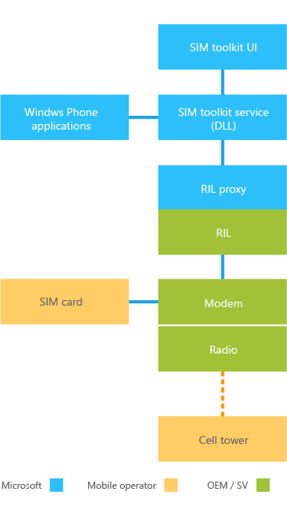

# SIM toolkit

SIM toolkit is a set of applications on the SIM that can be activated by network events or user actions. SIM toolkit applications are represented by proactive commands that are defined by 3GPP and ETSI specifications. Windows 10 Mobile supports a subset of the SIM toolkit commands. For a list of the supported commands, see [SIM toolkit commands](sim-toolkit-commands.md).

## SIM toolkit components

The three main components of SIM toolkit are:

-   The modem and the radio interface layer (RIL) software provided by the silicon vendor.

-   The service, which is a native-code DLL.

-   The user interface (UI).

Both the SIM toolkit service and user interface are provided by Microsoft.

The following diagram illustrates the main components of SIM toolkit.

### SIM toolkit service

The SIM toolkit service is part of the Windows 10 Mobile OS. It runs as a background task, and serves as a command interpreter between the SIM and the SIM toolkit UI application.

### SIM toolkit UI application

The SIM toolkit UI displays text as directed by the SIM toolkit service.

The SIM toolkit UI application displays two types of text strings:

-   Application management strings are part of the SIM toolkit UI. Microsoft localizes these strings into the languages supported by Windows.

-   Text strings that are displayed as part of the message interaction with the SIM are provided by the mobile operator. Microsoft does not localize these text strings.

The SIM toolkit UI application can also play tones and launch the browser.

### SIM toolkit customizations

OEMs can modify the display period for certain dialogs or messages if the default values do not meet the requirements of the mobile operator. These customization settings are available in both MCSF and Windows provisioning so you can choose which method to use. The default display times are as follows:

-   GETINPUT: 120 seconds

-   DISPLAYTEXT: 60 seconds

-   SELECTITEM: 60 seconds

-   GETINKEY: 60 seconds

For information about these customizations, see [Customize the SIM toolkit](https://msdn.microsoft.com/library/windows/hardware/mt629102).

### Example of processing a SIM toolkit command

The following is an example of processing the SIM toolkit DISPLAY TEXT command:

-   The SIM sends the DISPLAY TEXT command.

-   The SIM toolkit service receives the DISPLAY TEXT and passes the command to the SIM toolkit UI.

-   The SIM toolkit UI displays the text string.

## Starting the SIM toolkit UI application

When the SIM toolkit UI application is installed, a **SIM applications** button appears on the **Settings** &gt; **network & wireless** &gt; **Cellular & SIM** &gt; **advanced options** screen. To start the application, tap the button.

The **SIM applications** button is hidden if any of the following apply:

-   SIM PIN locked (for 2G SIM)

-   PUK (personal unlock key) locked (for 2G SIM)

-   No SIM applications on the SIM

-   No SIM present

When the SIM toolkit UI application is successfully started, a SIM toolkit UI displays options for the user to select. The options are determined by the applications on the SIM.

## Launching the SIM toolkit using another app

To make the SIM toolkit more discoverable, partners can use a reserved URI scheme to enable a UWP app to launch the SIM applications CPL. For more information about how to do this, see [Reserved URI to launch SIM toolkit](reserved-uri-to-launch-sim-toolkit.md).

## SIM toolkit UI notifications

The SIM application UI is not displayed if a SIM command is received while in the phone dialer screen. In this case, a notification toast is displayed at the top of the screen. Tapping the toast launches the SIM application UI. In all other scenarios, the SIM toolkit UI application is launched and displayed on the entire screen.

## Additional reference

The following settings are recommended:

-   Set the lock screen time-out to Never while running tests, so the lock screen does not interfere with the tests. By default, it is set to 1 minute.

-   For CDMA devices, ensure the APN is set on the device.

-   Some test suites have a default timer value of 90 seconds. If applicable, ensure the time-out customization registry values are set accordingly.

## Related topics

[SIM toolkit commands](sim-toolkit-commands.md)

 

 

