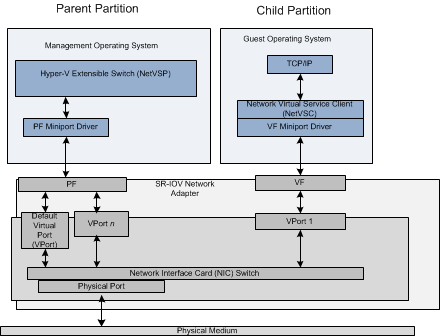

# SR-IOV VF Data Path

If the physical network adapter supports the single root I/O virtualization (SR-IOV) interface, it can enable one or more PCI Express (PCIe) Virtual Functions (VFs). Each VF can be attached to a Hyper-V child partition. When this happens, the virtualization stack performs the following steps:

1.  Once resources for the VF are allocated, the virtualization stack exposes a network adapter for the VF in the guest operating system. This causes the PCI driver that runs in the guest operating system to start the VF miniport driver. This driver is provided by the independent hardware vendor (IHV) for the SR-IOV network adapter.

    **Note**  Resources for the VF must be allocated by the miniport driver for the PCIe Physical Function (PF) before the VF can be attached to the Hyper-V child partition. VF resources include assigning a virtual port (VPort) on the NIC switch to the VF. For more information, see [SR-IOV Virtual Functions](sr-iov-virtual-functions--vfs-.md).

2.  After the VF miniport driver is loaded and initialized, NDIS binds the protocol edge of the Network Virtual Service Client (NetVSC) in the guest operating system to the driver.

    **Note**  NetVSC only binds to the VF miniport driver. No other protocol stacks in the guest operating system can bind to the VF miniport driver.

After the NetVSC successfully binds to the driver, network traffic in the guest operating system occurs over the *VF data path*. Packets are sent or received over the underlying VF of the network adapter instead of the software-based synthetic data path. For more information about the synthetic data path, see [SR-IOV Synthetic Data Path](sr-iov-synthetic-data-path.md).

The following diagram shows the components of the VF data path over an SR-IOV network adapter.

The use of the VF data path provides the following benefits:

-   All data packets flow directly between the networking components in the guest operating system and the VF. This eliminates the overhead of the synthetic data path in which data packets flow between the Hyper-V child and parent partitions.

    For more information about the synthetic data path, see [SR-IOV Synthetic Data Path](sr-iov-synthetic-data-path.md).

-   The VF data path bypasses any involvement by the management operating system in packet traffic from a Hyper-V child partition. The VF provides independent memory space, interrupts, and DMA streams for the child partition to which it is attached. This achieves networking performance that is almost compatible with nonvirtualized environments.

-   The routing of packets over the VF data path is performed by the NIC switch on the SR-IOV network adapter. Packets are sent or received over the external network through the physical port of the adapter. Packets are also forwarded to or from other child partitions to which a VF is attached.

    **Note**  Packets to or from child partitions to which no VF is attached are forwarded by the NIC switch to the Hyper-V extensible switch module. This module runs in the Hyper-V parent partition and delivers these packets to the child partition by using the synthetic data path.