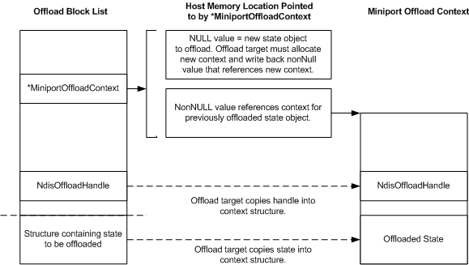

# Storing and Referencing Offloaded State

\[The TCP chimney offload feature is deprecated and should not be used.\]

For each [offload state object](offload-state-objects.md) that an offload target offloads from the host stack, the offload target allocates a unique offload context area in which to store the offloaded state object and information about that state object. This context area can be in host memory or NIC memory.

An offload context area must contain the following:

-   The offloaded state object

-   For a TCP connection state object or a neighbor state object, the handle in the **NdisOffloadHandle** member of the [**NDIS\_MINIPORT\_OFFLOAD\_BLOCK\_LIST**](https://msdn.microsoft.com/library/windows/hardware/ff566469) structure that was originally associated with the offloaded state object

The following figure shows the relationship between members of an NDIS\_MINIPORT\_OFFLOAD\_BLOCK\_LIST structure and the offload context area into which the offload target offloads the state that is associated with the block list structure.

Each NDIS\_MINIPORT\_OFFLOAD\_BLOCK\_LIST structure in the offload state tree that is passed to an offload target's [*MiniportInitiateOffload*](https://msdn.microsoft.com/library/windows/hardware/ff559393) function contains a **MiniportOffloadContext** member. A non-NULL value in the **MiniportOffloadContext** member points to a memory location into which the offload target writes a PVOID value. This PVOID value references the context structure in which the offload target stores the offloaded state object.

As long as the state remains offloaded, the PVOID value that the offload target supplies remains valid. In subsequent calls to the offload target's [**MiniportQueryOffload**](https://msdn.microsoft.com/library/windows/hardware/ff559423), [**MiniportUpdateOffload**](https://msdn.microsoft.com/library/windows/hardware/ff560463), [**MiniportInvalidateOffload**](https://msdn.microsoft.com/library/windows/hardware/ff559406), or [**MiniportTerminateOffload**](https://msdn.microsoft.com/library/windows/hardware/ff559468) function, the host stack can reference this PVOID value by specifying a value in the **MiniportOffloadContext** member that points to the memory location that contains the PVOID value. Referencing the PVOID value references the offload state in the context area that the PVOID value references.

Each NDIS\_MINIPORT\_OFFLOAD\_BLOCK\_LIST structure contains an **NdisOffloadHandle** member that specifies a handle. The offload target stores this handle in the context area for the offloaded state object. When referencing the offloaded state object in subsequent calls to the [**NdisTcpOffloadEventHandler**](https://msdn.microsoft.com/library/windows/hardware/ff564595) or [**NdisTcpOffloadReceiveHandler**](https://msdn.microsoft.com/library/windows/hardware/ff564606) functions, the offload target passes in the stored handle as an input parameter.

Although the offload target is not required to store such a handle for a path state object, it should do so anyway. The offload target never references a path state object when it calls an indication function. However, it is possible that a change in the TCP chimney architecture could require the offload target to do so in the future.

 

 

