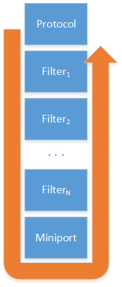
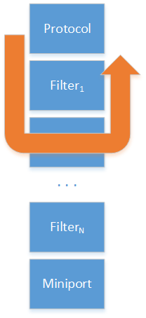
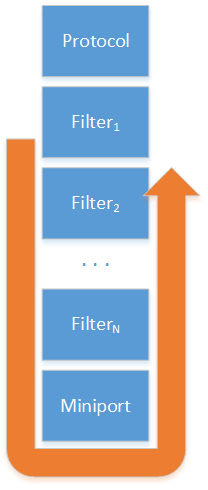
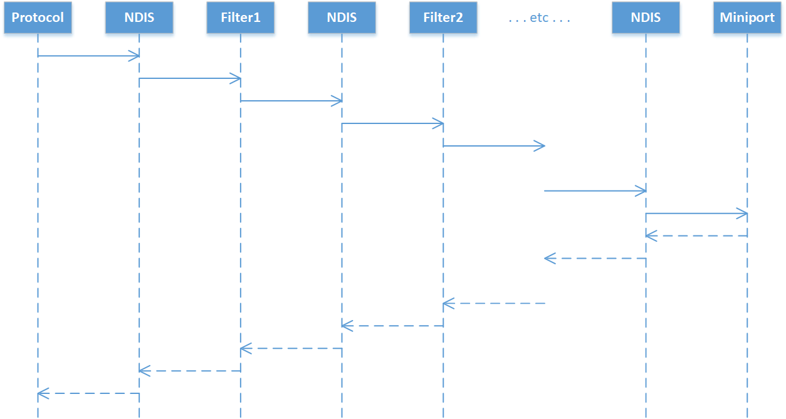
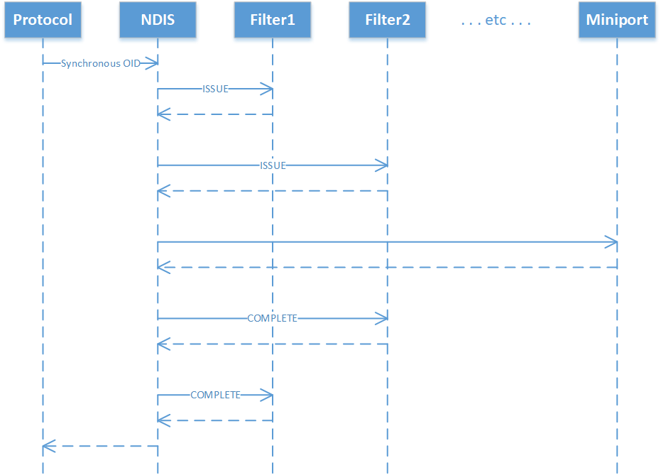
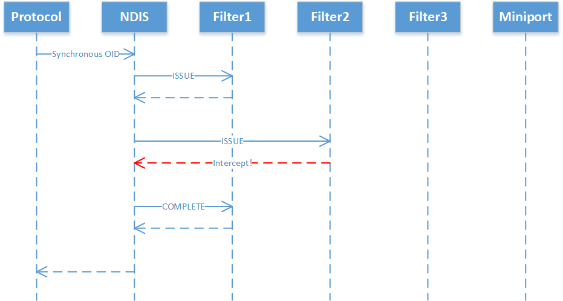

# Synchronous OID request interface in NDIS 6.80

Windows network drivers use OID requests to send control messages down the NDIS binding stack. Protocol drivers, such as TCPIP or vSwitch, rely on dozens of OIDs to configure each feature of the underlying NIC driver. Before Windows 10, version 1709, OID requests were sent in two ways: Regular and Direct. 

This topic introduces a third style of OID call: Synchronous. A Synchronous call is meant to be low-latency, non-blocking, scalable, and reliable. The Synchronous OID request interface is available starting in NDIS 6.80, which is included in Windows 10, version 1709 and later.

## Comparison to Regular and Direct OID requests

With Synchronous OID requests, the payload of the call (the OID itself) is exactly the same as with Regular and Direct OID requests. The only difference is in the call itself. Therefore, the *what* is the same across all three types of OIDs; only the *how* is different.

The following table describes the differences between Regular OIDs, Direct OIDs, and Synchronous OIDs.

| Attribute | Regular OID | Direct OID | Synchronous OID |
| --- | --- | --- | --- |
| Payload | [NDIS_OID_REQUEST](/windows-hardware/drivers/ddi/oidrequest/ns-oidrequest-ndis_oid_request) | NDIS_OID_REQUEST | NDIS_OID_REQUEST |
| OID types | Stats, Query, Set, Method | Stats, Query, Set, Method | Stats, Query, Set, Method |
| Can be issued by | Protocols, filters | Protocols, filters | Protocols, filters |
| Can be completed by | Miniports, filters | Miniports, filters | Miniports, filters |
| Filters can modify | Yes | Yes | Yes |
| NDIS allocates memory | For each filter (OID clone) | For each filter (OID clone) | Only if unusually large number of filters (call context) |
| Can pend | Yes | Yes | No |
| Can block | Yes | No | No |
| IRQL | == PASSIVE | \<= DISPATCH | \<= DISPATCH |
| [Serialized by NDIS](miniport-adapter-oid-request-serialization.md) | Yes | No | No |
| Filters are invoked | Recursively | Recursively | Iteratively |
| Filters clone the OID | Yes | Yes | No |

## Filtering

Like the other two types of OID calls, filter drivers have full control over the OID request in a Synchronous call. Filter drivers can observe, intercept, modify, and issue Synchronous OIDs. However, for efficiency, the mechanics of a Synchronous OID are somewhat different.

### Passthrough, interception, and origination

Conceptually, all OID requests are issued from a higher driver and are completed by a lower driver. Along the way, the OID request may pass through any number of filter drivers.

In the most common case, a protocol driver issues an OID request and all filters simply pass the OID request down, unmodified. The following figure illustrates this common scenario.



However, any filter module is allowed to intercept the OID request and complete it. In that case, the request does not pass through to lower drivers, as shown in the following diagram.



In some cases, a filter module may decide to originate its own OID request. This request starts at the filter module's level and only traverses lower drivers, as the following diagram shows.



All OID requests have this basic flow: a higher driver (either a protocol or filter driver) issues a request and a lower driver (either a miniport or filter driver) completes it.

### How Regular and Direct OID requests work

Regular or Direct OID requests are dispatched recursively. The following diagram shows the function call sequence. Note that the sequence itself is much like the sequence described in the diagrams from the previous section, but is arranged to show the recursive nature of the requests.



If there are enough filters installed, NDIS will be forced to allocate a new thread stack to keep recursing deeper.

NDIS considers an [NDIS_OID_REQUEST](/windows-hardware/drivers/ddi/oidrequest/ns-oidrequest-ndis_oid_request) structure to be valid for only a single hop along the stack. If a filter driver wants to pass the request down to the next lower driver (which is the case for the vast majority of OIDs), the filter driver *must* insert several dozen lines of boilerplate code to clone the OID request. This boilerplate has several problems:

1. It forces a memory allocation to clone the OID. Hitting the memory pool is both slow and makes it impossible to guarantee forward progress of the OID request.
2. The OID structure design must remain the same over time because all filter drivers hard-code the mechanics of copying the contents of one NDIS_OID_REQUEST to another.
3. Requiring so much boilerplate obscures what the filter is really doing.

### The filtering model for Synchronous OID requests

The filtering model for Synchronous OID requests takes advantage of the synchronous nature of the call, to solve the problems discussed in the previous section.

#### Issue and Complete handlers

Unlike Regular and Direct OID requests, there are two filter hooks for Synchronous OID requests: an Issue handler and a Complete handler. A filter driver can register neither, one, or both hooks.

Issue calls are invoked for each filter driver, starting from the top of the stack down to the bottom of the stack. Any filter’s Issue call can stop the OID from continuing downward, and complete the OID with some status code. If no filter decides to intercept the OID, then the OID reaches the NIC driver, which must complete the OID synchronously.

After an OID is completed, Complete calls are invoked for each filter driver, starting from wherever in the stack the OID was completed, up to the top of the stack. A Complete call can inspect or modify the OID request, and inspect or modify the OID’s completion status code.

The following diagram illustrates the typical case, where a protocol issues a Synchronous OID request and the filters do not intercept the request.



Note that the call model for Synchronous OIDs is iterative. This keeps stack usage bounded by a constant, eliminating the need to ever expand the stack.

If a filter driver intercepts a Synchronous OID in its Issue handler, the OID is not given to lower filters or the NIC driver. However, Complete handlers for higher filters are still invoked, as shown in the following diagram:



#### Minimal memory allocations

Regular and Direct OID requests require a filter driver to clone an NDIS_OID_REQUEST. In contrast, Synchronous OID requests are not permitted to be cloned. The advantage of this design is that Synchronous OIDs have lower latency – the OID request isn’t repeatedly cloned as it travels down the filter stack – and there are fewer opportunities for failure.

However, that does raise a new problem. If the OID cannot be cloned, where does a filter driver store its per-request state? For example, suppose a filter driver translates one OID to another. On the way down the stack, the filter needs to save off the old OID. On the way back up the stack, the filter needs to restore the old OID.

To solve this problem, NDIS allocates a pointer-sized slot for each filter driver, for each in-flight Synchronous OID request. NDIS preserves this slot across the call from a filter’s Issue handler to its Complete handler. This allows the Issue handler to save off state that is later consumed by the Complete handler. The following code snippet shows an example.

```cpp
NDIS_STATUS
MyFilterSynchronousOidRequest(
  _In_ NDIS_HANDLE FilterModuleContext,
  _Inout_ NDIS_OID_REQUEST *OidRequest,
  _Outptr_result_maybenull_ PVOID *CallContext)
{
  if ( . . . should intercept this OID . . . )
  {
    // preserve the original buffer in the CallContext
    *CallContext = OidRequest->DATA.SET_INFORMATION.InformationBuffer;

    // replace the buffer with a new one
    OidRequest->DATA.SET_INFORMATION.InformationBuffer = . . . something . . .;
  }

  return NDIS_STATUS_SUCCESS;
}

VOID
MyFilterSynchronousOidRequestComplete(
  _In_ NDIS_HANDLE FilterModuleContext,
  _Inout_ NDIS_OID_REQUEST *OidRequest,
  _Inout_ NDIS_STATUS *Status,
  _In_ PVOID CallContext)
{
  // if the context is not null, we must have replaced the buffer.
  if (CallContext != null)
  {
    // Copy the data from the miniport back into the protocol’s original buffer.
    RtlCopyMemory(CallContext, OidRequest->DATA.SET_INFORMATION.InformationBuffer,...);
     
    // restore the original buffer into the OID request
    OidRequest->DATA.SET_INFORMATION.InformationBuffer = CallContext;
  }
}
```

NDIS saves one PVOID per filter per call. NDIS heuristically allocates a reasonable number of slots on the stack, so that there are zero pool allocations in the common case. This is usually no more than seven filters. If the user sets up a pathological case, NDIS does fall back to a pool allocation.

#### Reduced boilerplate

Consider the boilerplate on [Example boilerplate for handling Regular or Direct OID requests](example-boilerplate-for-handling-regular-or-direct-oid-requests.md). That code is the cost of entry just to register an OID handler. If you want to issue your own OIDs, you have to add another dozen lines of boilerplate. With Synchronous OIDs, there's no need for the additional complexity of handling asynchronous completion. Therefore, you can cut out much of that boilerplate.

Here's a minimal issue handler with Synchronous OIDs:

```cpp
NDIS_STATUS
MyFilterSynchronousOidRequest(
  NDIS_HANDLE FilterModuleContext,
  NDIS_OID_REQUEST *OidRequest,
  PVOID *CallContext)
{
  return NDIS_STATUS_SUCCESS;
}
```

If you want to intercept or modify a particular OID, you can do it by adding just a couple lines of code. The minimal Complete handler is even simpler:

```cpp
VOID
MyFilterSynchronousOidRequestComplete(
  NDIS_HANDLE FilterModuleContext,
  NDIS_OID_REQUEST *OidRequest,
  NDIS_STATUS *Status,
  PVOID CallContext)
{
  return;
}
```

Likewise, a filter driver can issue a new Synchronous OID request of its own using only one line of code:

```cpp
status = NdisFSynchronousOidRequest(binding->NdisBindingHandle, &oid);
```

In contrast, a filter driver that needs to issue a Regular or Direct OID must set up an asynchronous completion handler and implement some code to distinguish its own OID completions from the completions of OIDs that it just cloned. An example of this boilerplate is shown on [Example boilerplate for issuing a Regular OID request](example-boilerplate-for-issuing-a-regular-oid-request.md).

## Interoperability

Although the Regular, Direct, and Synchronous calling styles all use the same data structures, the pipelines do not go to the same handler in the miniport. Furthermore, some OIDs cannot be used in some of the pipelines. For example, [OID_PNP_SET_POWER](oid-pnp-set-power.md) requires careful synchronization and often forces the miniport to make blocking calls. This makes handling it difficult in a Direct OID callback and prevents its use in a Synchronous OID callback. 

Therefore, just as with Direct OID requests, Synchronous OID calls can only be used with a subset of OIDs. In Windows 10, version 1709, only the [OID_GEN_RSS_SET_INDIRECTION_TABLE_ENTRIES](oid-gen-rss-set-indirection-table-entries.md) OID used in [Receive Side Scaling Version 2 (RSSv2)](receive-side-scaling-version-2-rssv2-.md) is supported in the Synchronous OID path.

## Implementing Synchronous OID requests

For more info about implementing the Synchronous OID request interface in drivers, see the following topics:

- [Miniport Adapter OID Requests](miniport-adapter-oid-requests.md)
- [Filter Module OID Requests](filter-module-oid-requests.md)
- [Protocol Driver OID Requests](protocol-driver-oid-requests.md)
