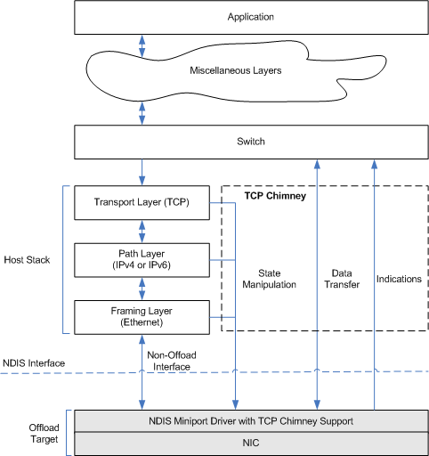

# TCP Chimney Architecture

\[The TCP chimney offload feature is deprecated and should not be used.\]

The following figure shows the TCP chimney architecture. The shaded areas represent components that are supplied by a vendor of a TCP chimney-capable NIC.

The TCP chimney architecture contains the following major components:

-   **Host stack**

-   **Offload target**, which is a miniport driver/NIC combination

-   **TCP chimney interfaces**

### Host Stack

The host stack contains the following layers:

Transport Layer (TCP)  
Open Systems Interconnect (OSI) Layer 4. The TCP layer provides TCP protocol processing for non-offloaded TCP connections and some TCP protocol processing (for example, connection setup) for offloaded TCP connections.

Path Layer (IPv4 and IPv6)  
OSI Layer 3. The path layer handles internetwork processing (for example, IPv4 or IPv6).

Framing Layer (Ethernet)  
OSI Layer 2. The framing layer processes packet framing, including address translation between the path layer and the framing layer (for example, Address Resolution Protocol (ARP) or neighbor discovery).

### Offload Target

An offload target, which is supplied by the vendor, consists of a TCP chimney-capable NDIS miniport driver and a TCP chimney-capable NIC. The miniport driver exports both generic chimney and TCP chimney functions. (For more information about registering TCP chimney functions, see [Registering Chimney Offload Functions](registering-chimney-offload-functions.md).) The NIC typically contains a TCP protocol stack that performs data transfer-related processing on offloaded TCP connections. The vendor can, however, determine what TCP offload processing is performed by the miniport driver and what TCP offload processing is performed by the NIC.

An offload target performs only TCP-related data I/O processing on offloaded TCP connections. An offload target does not perform connection setup and network management functions.

### TCP Chimney Interfaces

The TCP chimney provides the following three interfaces that offload targets can use:

-   State-manipulation interface

-   Data I/O interface

-   Event indication interface

**State-manipulation interface**

After the host stack has set up one or more TCP connections with the remote TCP peer, it can offload those connections, and the supporting protocol state from the path and framing layers, to the offload target through the TCP chimney's state-manipulation interface. From each of the TCP, path, and framing layers, the host stack offloads [state objects](offload-state-objects.md). Each state object contains a set of [state variables](classes-of-offload-state-variables.md). To offload multiple TCP connections and associated state objects at once (a bulk offload), the host stack passes a [state tree](offload-state-tree.md) of state objects to the offload target.

Through the state-manipulation interface, the host stack can perform the following operations on offloaded state objects:

-   [Query variable values](querying-offloaded-state.md)

-   [Update certain variable values](updating-offloaded-state.md)

-   [Invalidate offloaded state objects](invalidating-offloaded-state.md)

-   [Terminate offloaded state objects](terminating-offload-state.md)

**Data I/O interface**

After a TCP connection has been offloaded, data transfer on that connection (with some exceptions) goes through the TCP chimney data I/O interface. This interface bypasses most of the host stack. Application data that is to be transmitted enters the top of the chimney and goes directly to the offload target at the bottom of the chimney. Data that is received by the offload target enters the bottom of the chimney and goes directly to the application.

A logical switch controls whether data I/O goes through the host stack or through the TCP chimney. If the data I/O is on an offloaded TCP connection, the switch routes the data through the TCP chimney. If the data I/O is on a non-offloaded TCP connection, the switch routes the data through the host stack.

For more information about sending data, see [Sending Data from an Offload Target](sending-data-from-an-offload-target.md). For more information about receiving data, see [Delivering Received Data From an Offload Target](delivering-received-data-from-an-offload-target.md).

**Event indication interface**

An offload target indicates an event to the host stack by calling one of the following functions:

-   [**NdisMOffloadEventIndicate**](https://msdn.microsoft.com/library/windows/hardware/ff563619)

-   [**NdisTcpOffloadEventHandler**](https://msdn.microsoft.com/library/windows/hardware/ff564595)

-   [**NdisMIndicateStatusEx**](https://msdn.microsoft.com/library/windows/hardware/ff563600)

An offload target calls the [**NdisMOffloadEventIndicate**](https://msdn.microsoft.com/library/windows/hardware/ff563619) function to indicate that a neighbor cache entry (NCE) has become stale. For more information about NCEs, see RFC 2461. The host stack uses the [NeighborReachabilityQuery indication](making-a-neighborreachabilityquery-indication.md) to detect neighbor unreachability for IPv4 and IPv6.

An offload target calls the [**NdisTcpOffloadEventHandler**](https://msdn.microsoft.com/library/windows/hardware/ff564595) function to make one of the following types of indications:

**TcpIndicateDisconnect**  
The remote host has initiated a graceful disconnect by sending a FIN segment on the connection.

**TcpIndicateRetrieve**  
The offload target is requesting the host stack to terminate a TCP connection.

**TcpIndicateAbort**  
The remote host has initiated an abortive disconnect by sending an acceptable RST segment on the connection.

**TcpIndicateSendBacklogChange**  
The preferred send backlog size has changed.

An offload target can call the **NdisMIndicateStatusEx** function to request the host stack to:

-   Terminate the offload of all TCP connections that are offloaded to the offload target.

-   Stop offloading state objects to the offload target.

-   Resume offloading state objects to the offload target.

 

 

