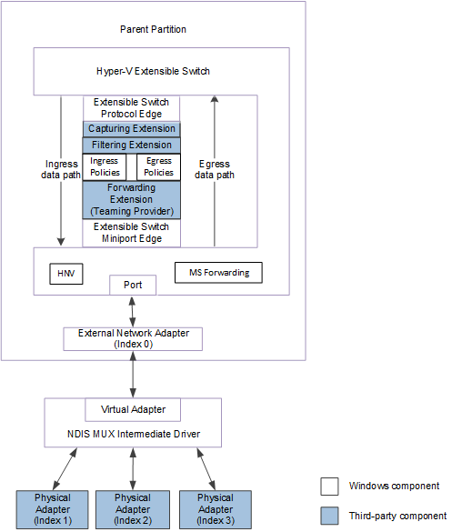
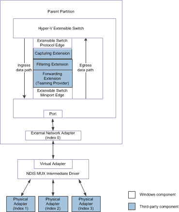

# Teaming Provider Extensions

The extensible switch external network adapter can be bound to the virtual miniport edge of an NDIS multiplexer (MUX) intermediate driver. The MUX intermediate driver itself can be bound to a team of one or more physical networks on the host. This configuration is known as an *extensible switch team*. For more information about extensible switch teams, see [Types of Physical Network Adapter Configurations](types-of-physical-network-adapter-configurations.md).

In this configuration, the extensible switch extensions are exposed to every network adapter in the extensible switch team. This allows the forwarding extension in the extensible switch driver stack to manage the configuration and use of individual network adapters in the team. For example, the extension can provide support for a load balancing failover (LBFO) solution over the team by forwarding outgoing packets to individual adapters. Such an extension is known as a *teaming provider*.

The following figure shows the data path for packet traffic to or from the underlying extensible switch team that is bound to the external network adapter for NDIS 6.40 (Windows Server 2012 R2) and later.

The following figure shows the data path for packet traffic to or from the underlying extensible switch team that is bound to the external network adapter for NDIS 6.30 (Windows Server 2012).

Teaming providers can do everything that a forwarding extension can. In addition, teaming providers can do the following.

-   Forward outgoing packets to an individual physical adapter in the extensible switch team. This ability is especially useful for LBFO functionality.

-   Forward standard NDIS object identifier (OID) requests to an individual physical adapter in the extensible switch team. This ability is especially useful for configuring the adapters in the team for hardware offloads.

    For example, the MUX driver advertises the common capabilities of the entire extensible switch team. However, the teaming provider can issue OID requests to query the individual capabilities of adapters within the team. Then, the teaming provider can issue OID requests to the extensible switch external network adapter to set the capabilities that apply to the entire team.

-   Forward private OID requests to an individual physical adapter in the extensible switch team. These private OID requests are defined by the independent hardware vendor (IHV) for the physical network adapters. This allows a teaming provider that was also developed by the IHV to enable or disable proprietary attributes on individual physical adapters in the team.

-   Modify NDIS status indications from the extensible switch team. This ability is especially useful for managing the extensible switch team for hardware offloads.

    For example, the MUX driver issues NDIS status indications with settings that are common for the entire extensible switch team. If the status indication was for a hardware offload that the teaming provider enabled for a network adapter in the extensible switch team, the teaming provider can first issue an OID request to query the current capabilities on that adapter. Then, the teaming provider can modify the indication data to set those attributes that may have changed on the adapter.

Teaming providers must follow these guidelines when managing an extensible switch team:

-   The teaming provider must maintain state for every physical network adapter for which an extensible switch network connection had been established.

    For every physical network adapter that is bound to the external network adapter, the protocol edge of the extensible switch issues a separate OID set request of [OID\_SWITCH\_NIC\_CREATE](https://msdn.microsoft.com/library/windows/hardware/hh598263). This OID request notifies the extension about the creation of a network connection to an underlying physical adapter.

-   When the network connection to the physical network adapter is created, it is assigned a nonzero index value that is unique for the port to which the external network adapter is connected.

    The teaming provider must specify the network adapter index value when it issues or forwards packets or OID requests to an underlying physical network adapter.

    For more information, see [Network Adapter Index Values](network-adapter-index-values.md).

-   If the teaming provider issues or forwards packets to a physical adapter, it must specify the nonzero network adapter index value of the physical adapter connection.

    When the provider receives packets, it can determine the source network adapter index value from the packet's out-of-band forwarding context in the [**NET\_BUFFER\_LIST**](https://msdn.microsoft.com/library/windows/hardware/ff568388) structure. For more information about the forwarding context, see [Hyper-V Extensible Switch Forwarding Context](hyper-v-extensible-switch-forwarding-context.md).

    For more information, see [Hyper-V Extensible Switch Data Path](hyper-v-extensible-switch-data-path.md).

-   To issue forward OID requests to a physical adapter, the teaming provider must encapsulate the OID request within an [**NDIS\_SWITCH\_NIC\_OID\_REQUEST**](https://msdn.microsoft.com/library/windows/hardware/hh598214) structure. The provider must set the **DestinationNicIndex** member to the nonzero network adapter index value of the physical adapter connection. The provider then issues an OID set request of [OID\_SWITCH\_NIC\_REQUEST](https://msdn.microsoft.com/library/windows/hardware/hh598266) to deliver the encapsulated OID request to the target physical adapter.

    For more information, see [Managing OID Requests to Physical Network Adapters](managing-oid-requests-to-physical-network-adapters.md).

-   The teaming provider can issue NDIS status indications on behalf of an underlying physical adapter. To do this, the provider must encapsulate the indication within an [**NDIS\_SWITCH\_NIC\_STATUS\_INDICATION**](https://msdn.microsoft.com/library/windows/hardware/hh598217) structure. The provider must set the **SourceNicIndex** member to the nonzero network adapter index value of the physical adapter connection. The provider then issues an NDIS status indication of [**NDIS\_STATUS\_SWITCH\_NIC\_STATUS**](https://msdn.microsoft.com/library/windows/hardware/hh598205) to deliver the encapsulated status indication to overlying drivers in the extensible switch driver stack.

    For more information, see [Managing NDIS Status Indications from Physical Network Adapters](managing-ndis-status-indications-from-physical-network-adapters.md).

For more information about forwarding extensions, see [Forwarding Extensions](forwarding-extensions.md).

For more information on MUX drivers, see [NDIS MUX Intermediate Drivers](ndis-mux-intermediate-drivers.md).

 

 

