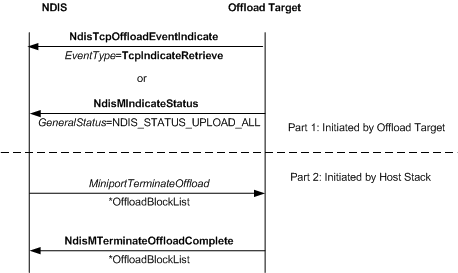

# Terminate Offload Sequence

\[The TCP chimney offload feature is deprecated and should not be used.\]

The following figure shows the terminate offload sequence. An offload target performs Part 1, and the host stack performs Part 2. If the offload target does not request the terminate offload operation, the sequence starts with the first step of Part 2.

### Part 1: Terminate Offload Requested by an Offload Target.

The offload target calls either of the following:

-   [**NdisTcpOffloadEventHandler**](https://msdn.microsoft.com/library/windows/hardware/ff564595) with an event type of **TcpIndicateRetrieve** to request the host stack to terminate the offload of a single TCP connection. The offload target specifies the reason for the termination request as a TCP\_UPLOAD\_REASON value in the *EventSpecificInformation* parameter that it passes to the *NdisTcpOffloadEventHandler* function.

-   [**NdisMIndicateStatusEx**](https://msdn.microsoft.com/library/windows/hardware/ff563600) with the NDIS\_STATUS\_INDICATION-&gt; **StatusCode** member set to NDIS\_STATUS\_UPLOAD\_ALL to request the host stack to terminate the offload of all TCP connections that have been offloaded to the offload target.

### Part 2: Terminate Offload Initiated by the Host Stack

1.  NDIS calls the offload target's [**MiniportTerminateOffload**](https://msdn.microsoft.com/library/windows/hardware/ff559468) function. In this call, NDIS passes a pointer to an [**NDIS\_MINIPORT\_OFFLOAD\_BLOCK\_LIST**](https://msdn.microsoft.com/library/windows/hardware/ff566469) structure that can be stand-alone or the root of a linked list of such structures. Each NDIS\_MINIPORT\_OFFLOAD\_BLOCK\_LIST structure can be immediately followed in memory by a delegated state structure (*XXX*\_OFFLOAD\_STATE\_DELEGATED).

2.  The offload target copies delegated variable values into the host stack-supplied delegated state structures.

3.  The offload target writes a completion status of NDIS\_STATUS\_SUCCESS or NDIS\_STATUS\_FAILURE to the **Status** member of each NDIS\_MINIPORT\_OFFLOAD\_BLOCK\_LIST structure in the linked list.

4.  The offload target calls the [**NdisMTerminateOffloadComplete**](https://msdn.microsoft.com/library/windows/hardware/ff563685) function to return the linked block lists and the associated *XXX*\_OFFLOAD\_STATE\_DELEGATED structures to the host stack.

5.  The offload target frees all resources, such as memory, that are associated with the terminated state objects.

 

 

