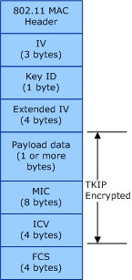

# TKIP

**Important**  The [Native 802.11 Wireless LAN](native-802-11-wireless-lan4.md) interface is deprecated in Windows 10 and later. Please use the WLAN Device Driver Interface (WDI) instead. For more information about WDI, see [WLAN Universal Windows driver model](wifi-universal-driver-model.md).

 

Temporal Key Integrity Protocol (TKIP) is the RC4-based cipher suite based on the algorithms defined in section 3 of the *Wi-Fi Protected Access (WPA)* specification and Clause 8.3.2 of the IEEE 802.11-2004 standard.

TKIP uses the same RC4 stream cipher that WEP uses but incorporates a key tumbling function that changes the RC4 algorithm encryption key with each transmitted or received packet.

If the 802.11 station supports the WPA authentication algorithm, it must support the TKIP cipher. For more information about this authentication algorithm, see [WPA](wpa.md).

If the 802.11 station supports the 802.11i Robust Security Network Association (RSNA) authentication algorithm, support for the TKIP cipher is optional. For more information about this authentication algorithm, see [RSNA](rsna.md).

The operating system supports TKIP for infrastructure basic service set (BSS) network types. However, the independent hardware vendor (IHV) can support TKIP for independent BSS (IBSS) network types as part of a cipher suite extension. For more information about cipher suite extensions, see [Extending Support for 802.11 Cipher Algorithms](extending-support-for-802-11-cipher-algorithms.md).

The TKIP cipher uses the following keys:

-   128 bit key for encryption and decryption.

-   64 bit key for forgery protection through Message Integrity Code (MIC), using the Michael algorithm. For more information about the Michael algorithm, refer to Clause 8.3.2.3 of the IEEE 802.11i-2004 standard.

A TKIP key can be one of the following:

Pairwise key  
This key is used for all packets sent by the 802.11 station, including unicast, multicast, and broadcast packets. The pairwise key is also used for all unicast packets received by the station.

The 802.11 station must support at least one pairwise key. For the pairwise key, the station must use either a key at index 0 in the default key table or a key-mapping key indexed by the media access control (MAC) address of the access point (AP).

Group key  
This key is used for all multicast and broadcast packets received by the 802.11 station.

If the AP advertises a pairwise cipher suite of "Use Group," the 802.11 station will use the group key to send and receive unicast and broadcast or multicast packets if it associates with the AP. For more information about the "Use Group" cipher suite, refer to Clause 7.3.2.25 of the IEEE 802.11i-2004 standard.

Due to group key rotation, the 802.11 station must support at least two group keys. For the group keys, the station must use keys at index 1 through 3 in the default key table.

TKIP keys are derived through a mutual pairwise master key (PMK) that can be statically defined (preshared) on the 802.11 station or dynamically defined through a port-based authentication algorithm, such as IEEE 802.1X. The PMK is verified between the 802.11 station and the access point (AP) during the association operation.

The 802.11 station uses the following key types for TKIP cipher operations:

-   [Default Keys](default-keys.md)

-   [Key-Mapping Keys](key-mapping-keys.md)

The following figure illustrates the format of the 802.11 MAC protocol data unit (MPDU) frame encrypted through the TKIP algorithm.

The TKIP-encrypted MPDU frame consists of the following:

Initialization Vector (IV)  
Contains bytes 1 through 0 of the TKIP Sequence Counter (TSC), which is used for replay protection.

Key Identifier (ID)  
Bits 7 through 6 store the index of the key, within the default key table, used as the TKIP key. Bit 5 is set to indicate the presence of the Extended IV field. Bits 4 through 0 are reserved and are set to zero.

Extended IV  
Contains Bytes 5 through 2 of the TSC.

Payload Data  
Data from the MAC service data unit (MSDU) packet.

MIC  
The MIC value is computed using the Michael algorithm over the entire payload data of the MSDU packet. The 8-byte MIC field is added to the end of the last MPDU fragment of the MSDU.

Integrity Check Value (ICV)  
The checksum value computed over the unencrypted payload data.

Frame Check Sequence (FCS)  
The IEEE 32-bit cyclic redundancy code (CRC) computed over all fields of the MPDU.

 

 

