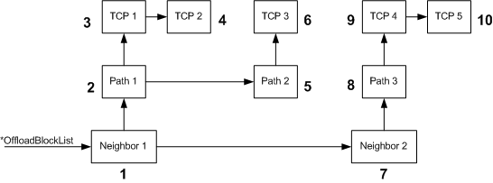

# Traversing a State Tree

\[The TCP chimney offload feature is deprecated and should not be used.\]

After returning from the [*MiniportInitiateOffload*](https://msdn.microsoft.com/library/windows/hardware/ff559393) function, the offload target traverses the offload state tree that is referenced by the *OffloadBlockList* parameter. The offload target offloads the state from this tree to its own internal offload context areas.

The offload target must offload the state from the tree in *depth-first/breadth-next* order. That is, the offload target must offload the state along the vertical dimension (following dependent block links that are created by pointers in **DependentBlockList** members) before offloading state along the horizontal dimension (following next block links that are created by pointers in **NextBlockList** members). Offloading the state in this order allows the offload target to offload as many TCP connections as possible.

The following figure shows the depth-first/breadth-next method of offloading the state.

To traverse the state tree in the preceding figure, an offload target:

1.  Starts with the root, Neighbor1, and offloads any new offload state that is associated with this block list.

2.  Follows the dependent link to Path1 and offloads any new Path1 offload state.

3.  Follows the dependent link to TCP1 and offloads any new TCP1 offload state.

4.  Follows the next block link to TCP2 and offloads any new TCP2 offload state.

5.  Because there is no next block link from TCP2, returns to TCP1 and then to Path1.

6.  Follows the next block link to Path2 and offloads any new Path2 state.

7.  Follows the dependent link to TCP3 and offloads any new TCP3 offload state.

8.  Because there is no next block link from TCP3, returns to Path2 and then to Neighbor1.

9.  Follows the next block link to Neighbor2 and offloads any new Neighbor2 state.

10. Follows the dependent link to Path3 and offloads any new Path3 offload state.

11. Follows the dependent link to TCP4 and offloads any new TCP4 offload state.

12. Follows the next block link to TCP5 and offloads any new TCP5 offload state.

13. Because there is no next block link from Path3 or Neighbor2, returns to Path3 and then to Neighbor2

14. Because there is no next block link from Neighbor2, stops.

It is extremely important that an offload target offload the state from a state tree in depth-first/breadth-next order.

Note that a TCP connection is enabled as soon as it is offloaded.

 

 

