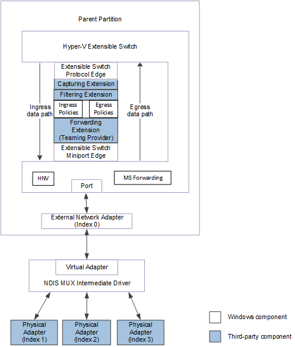

# Types of Physical Network Adapter Configurations

The Hyper-V extensible switch architecture supports the connection to a single external network adapter for access to the underlying physical medium. The external network adapter can be bound to one of the following physical network adapter configurations:

-   The external network adapter can be bound to a single underlying physical network adapter. In this configuration, an extensible switch extension is exposed to and manages only one underlying network adapter on the host.

    The following figure shows the extensible switch configuration in which the external network adapter is bound to a single physical network adapter for NDIS 6.40 (Windows Server 2012 R2) and later.

    

    The following figure shows the extensible switch configuration in which the external network adapter is bound to a single physical network adapter for NDIS 6.30 (Windows Server 2012).

    

-   The external network adapter can be bound to the virtual miniport edge of a load balancing failover (LBFO) provider. This is an NDIS filter driver that is layered above an NDIS multiplexer (MUX) driver, which may be bound to a team of one or more physical networks on the host. This configuration is known as an *LBFO team*.

    In this configuration, the extensible switch extensions are exposed to only the underlying virtual miniport edge as a network adapter. This allows the provider to support an LBFO solution by binding to multiple physical network adapters. These physical network adapters are not managed by a forwarding extension that runs in the extensible switch driver stack.

    The following figure shows an example of an LBFO team configuration for NDIS 6.40 (Windows Server 2012 R2) and later.

    

    The following figure shows an example of an LBFO team configuration for NDIS 6.30 (Windows Server 2012).

    

    **Note**  To extensible switch extensions, an underlying LBFO team appears as a single virtual network adapter that is bound to the external network adapter.

     

-   The external network adapter can be bound to the virtual miniport edge of an NDIS MUX intermediate driver. The MUX driver is bound to a team of one or more physical networks on the host. This configuration is known as an *extensible switch team*.

    In this configuration, an extensible switch extension is exposed to every network adapter in the team. This allows the extension to manage the configuration and use of individual network adapters in the team. For example, the extension can provide support for a load balancing failover (LBFO) solution over the team by forwarding outgoing packets to individual adapters.

    The following figure shows an example of an extensible switch team for NDIS 6.40 (Windows Server 2012 R2) and later.

    

    The following figure shows an example of an extensible switch team for NDIS 6.30 (Windows Server 2012).

    

For more information on MUX drivers, see [NDIS MUX Intermediate Drivers](ndis-mux-intermediate-drivers.md).

 

 

