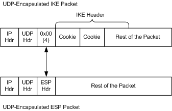
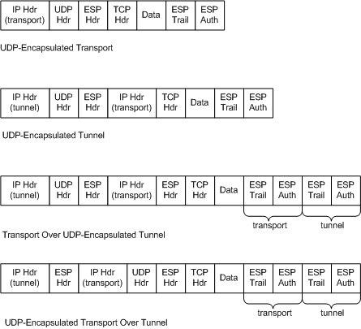

# UDP-ESP Encapsulation Types

\[The IPsec Task Offload feature is deprecated and should not be used.\]

The following figure shows the UDP encapsulation of Internet Key Exchange (IKE) packets and ESP-protected data packets that are received on port 4500.

Note the four bytes of zeros that follow the UDP header in IKE packets. This field of zeros differentiates IKE packets from UDP-encapsulated ESP packets on port 4500. Instead of zeros, ESP headers have a nonzero ESP header at this location in the packet.

### UDP-ESP Encapsulation Subtypes

ESP packets on port 4500 can be formatted according to one of the following UDP-ESP encapsulation subtypes:

-   UDP-encapsulated transport.

    An ESP-encapsulated transport-mode packet is encapsulated by UDP.

-   UDP-encapsulated tunnel.

    The tunnel-mode portion of a packet is UDP-encapsulated. The transport-mode portion of the packet is not UDP-encapsulated and is not ESP-protected.

-   Transport over UDP-encapsulated tunnel.

    The tunnel-mode portion of a packet is UDP-encapsulated. The transport-mode portion of a packet is not UDP-encapsulated, but is ESP-protected.

-   UDP-encapsulated transport over tunnel.

    The tunnel-mode portion of a packet is not UDP-encapsulated. The transport-mode portion of a packet is UDP-encapsulated and ESP-protected.

Note that a UDP-encapsulated transport over a UDP-encapsulated tunnel is not a supported encapsulation subtype.

The following figure shows the UDP-ESP encapsulation subtypes for port 4500.

 

 

