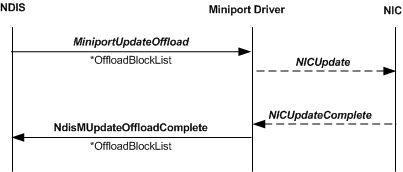

# Update Offload Sequence

\[The TCP chimney offload feature is deprecated and should not be used.\]

The following figure shows the call sequence for an update offload operation.

To update one or more offloaded variables, NDIS calls the offload target's [**MiniportUpdateOffload**](https://msdn.microsoft.com/library/windows/hardware/ff560463) function. The *MiniportUpdateOffload* function inputs the following parameters:

-   A handle in the *MiniportAdapterContext* parameter that references the adapter instance.

-   A pointer in the *OffloadBlockList* parameter that points to an [**NDIS\_MINIPORT\_OFFLOAD\_BLOCK\_LIST**](https://msdn.microsoft.com/library/windows/hardware/ff566469) structure. This structure can be stand-alone or the root of a linked list of NDIS\_MINIPORT\_OFFLOAD\_BLOCK\_LIST structures that form the framework of an [offload state tree](offload-state-tree.md).

The *MiniportUpdateOffload* function stores the pointer that is in *OffloadBlockList* and then returns. The offload target always completes the offload operation asynchronously by calling the [**NdisMUpdateOffloadComplete**](https://msdn.microsoft.com/library/windows/hardware/ff563694) function.

After the *MiniportUpdateOffload* function has returned, the offload target uses the offload state tree that is passed to the *MiniportUpdateOffload* function to update offloaded state objects:

-   The offload target copies the variable values from any state structures in the tree to the corresponding [offload state object](offload-state-objects.md). Only cached variables are updated.

-   The tree might indicate that path-to-neighbor links must be updated. (For more information about how these links are updated, see [Linking Path State Objects to a New Neighbor State Object](linking-path-state-objects-to-a-new-neighbor-state-object.md).) In this situation, the offload target must update its internal representation of offloaded state to reflect the updated links.

 

 

