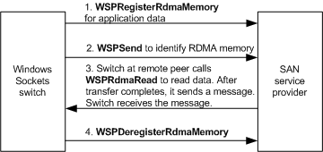
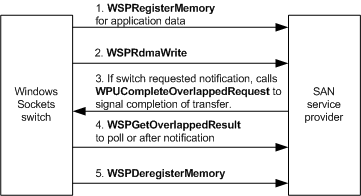

# Using Session Protocol

The Windows Sockets switch uses its session protocol to transfer data over a SAN connection. If the switch transfers a small amount of data, it transfers that data within a control message. Each control message consists of a header and an optional payload of application data. If the switch transfers a large amount of data, it transfers that data using RDMA operations.

This section describes how to set up and perform a data transfer.

**Note**  Depending on the behavior of applications that load the switch, the switch optimizes its session protocol to reduce the overhead involved in transferring application data.

 

This section also provides examples of how the switch's session protocol performs data transfers. However, these examples do not include definitive descriptions of these operations.

### Setting Up a Data Transfer

The switch allocates a pool of control message buffers for each connected socket. The switch then makes calls to the SAN service provider's [**WSPRegisterMemory**](https://msdn.microsoft.com/library/windows/hardware/ff566311) function to register those message buffers to regions of physical memory. The switch uses part of the buffer pool to send flow control information to a remote peer when calling a SAN service provider's [**WSPSend**](https://msdn.microsoft.com/library/windows/hardware/ff566316) function. The switch uses the other part of the pool to post message buffers to receive flow control information from a remote peer when calling a SAN service provider's [**WSPRecv**](https://msdn.microsoft.com/library/windows/hardware/ff566309) function. After the switch receives control messages, it immediately consumes them. After consuming control messages, the switch calls the SAN service provider's **WSPRecv** function and passes receive buffers to post them again so they can receive additional control messages from a remote peer.

### Transferring Application Data

The size of the data transfer affects how the switch will handle the data transfer operation.

If an application requests to send a small amount of data, the switch transfers that data as described in [Sending Urgent Data on a SAN](sending-urgent-data-on-a-san.md).

If an application requests to send a large amount of data, the switch copies the initial portion of the data to a control message buffer that is used for sending. The header for this control message contains information that specifies the amount of application data. The switch then calls the SAN service provider's [**WSPSend**](https://msdn.microsoft.com/library/windows/hardware/ff566316) function to send this control message to the SAN socket's remote peer.

How the switch completes the transfer of application data depends on whether the service provider supports the [**WSPRdmaRead**](https://msdn.microsoft.com/library/windows/hardware/ff566304) function.

### Data Transfer to a Provider That Supports the WSPRdmaRead Function

The following figure shows an overview of how the switch completes the transfer of application data if the SAN service provider at the remote peer supports a WSPRdmaRead function. The sequence that follows describes transferring application data in more detail.

### To transfer data when the remote peer supports WSPRdmaRead

-   The local switch must call the SAN service provider's [**WSPRegisterRdmaMemory**](https://msdn.microsoft.com/library/windows/hardware/ff566313) function to register RDMA memory for read access. In this case, the control header for the message buffer also identifies the descriptor for the RDMA memory that holds the application's remaining data.
-   The switch at the remote peer then calls [**WSPRdmaRead**](https://msdn.microsoft.com/library/windows/hardware/ff566304) to transfer application data from RDMA memory to receiving buffers that the switch at the remote peer previously registered with [**WSPRegisterMemory**](https://msdn.microsoft.com/library/windows/hardware/ff566311) calls. The SAN service provider transmits the buffered data in the background. Doing so allows applications that do not post more than one send at a time to post another send request while the SAN service provider sends buffered data.
-   The switch at the remote peer then calls [**WSPSend**](https://msdn.microsoft.com/library/windows/hardware/ff566316) to send a control message to the local switch to indicate that the transfer is complete.
-   The local switch calls the [**WSPDeregisterRdmaMemory**](https://msdn.microsoft.com/library/windows/hardware/ff566281) function to release RDMA memory.
-   The local switch completes the application's send request. If the switch cannot register memory for the application's data buffers or if temporary memory cannot be fully allocated, it completes an application's send request with the **WSAENOBUFS** error code.

### Data Transfer to a Provider That Does Not Support the WSPRdmaRead Function

The following figure shows an overview of how the switch completes the transfer of application data if the SAN service provider at the remote peer does not support a [**WSPRdmaRead**](https://msdn.microsoft.com/library/windows/hardware/ff566304) function. The sequence that follows describes transferring application data in more detail.

### To transfer data when the remote peer does not support WSPRdmaRead

-   The switch at the remote peer calls [**WSPRegisterRdmaMemory**](https://msdn.microsoft.com/library/windows/hardware/ff566313) to register RDMA memory for write access.
-   The switch at the remote peer then calls [**WSPSend**](https://msdn.microsoft.com/library/windows/hardware/ff566316) to send a control message to the local switch that indicates the location of RDMA memory to which the local switch can write.
-   The local switch calls the [**WSPRdmaWrite**](https://msdn.microsoft.com/library/windows/hardware/ff566306) function to transfer application data to the RDMA memory. The SAN service provider transmits the buffered data in the background. Doing so allows applications that do not post more than one send at a time to post another send request while the SAN service provider sends buffered data.
-   The local switch calls the [**WSPGetOverlappedResult**](https://msdn.microsoft.com/library/windows/hardware/ff566288) function to obtain the results of the transfer. For more information, see [Completing Data Transfer Requests](completing-data-transfer-requests.md).
-   The local switch calls [**WSPSend**](https://msdn.microsoft.com/library/windows/hardware/ff566316) to send a control message to the remote peer to indicate that the transfer is complete.
-   The switch at the remote peer calls [**WSPDeregisterRdmaMemory**](https://msdn.microsoft.com/library/windows/hardware/ff566281) to release RDMA memory.
-   The local switch completes the application's send request. If the switch cannot register memory for the application's data buffers or if temporary memory cannot be allocated, it completes an application's send request with the **WSAENOBUFS** error code.

## Related topics

[Transferring Data on a SAN](transferring-data-on-a-san.md)

 

 

