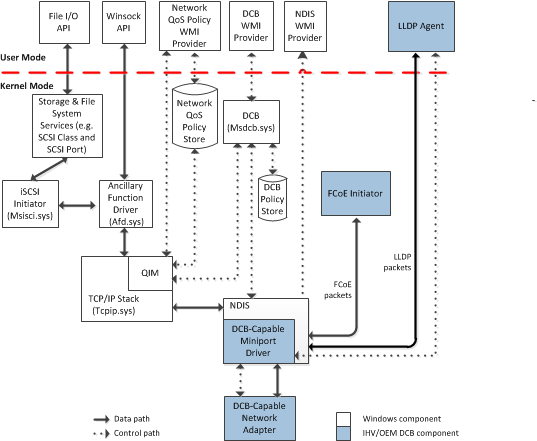

# Vendor-Provided DCB Components

This section describes the various components that are part of the NDIS Quality of Service (QoS) architecture for IEEE 802.1 Data Center Bridging (DCB). These components are shown in the following diagram.

The shaded boxes in the diagram represent DCB components that independent hardware vendors (IHVs) and original equipment manufacturers (OEMs) provide. The following list describes these components:

Link Layer Discovery Protocol (LLDP) Agent  
Starting with Windows Server 2012, vendors that support the IEEE 802.1Qaz DCB Exchange (DCBX) protocol can provide support for the IEEE 802.1Qab LLDP protocol over which DCBX is carried. This LLDP support can be provided through either the miniport driver or an LLDP agent.

Typically, the LLDP agent and the DCB-capable miniport driver communicate over a private control path, such as a private I/O control (IOCTL) interface.

If the vendor provides an LLDP agent, we highly recommend that the agent reside in user mode to mitigate the general stability risks associated with processing network packets.

Fibre Channel over Ethernet (FCoE) Initiator  
The Windows operating system does not natively support FCoE. To support FCoE, the vendor must provide an FCoE initiator stack that is used to connect to remote storage devices.

DCB-Capable Miniport Driver and Network Adapter  
To support NDIS QoS for DCB, the miniport driver and network adapter must support the requirements described in [NDIS QoS Requirements for Data Center Bridging](ndis-qos-requirements-for-data-center-bridging.md).

 

 

