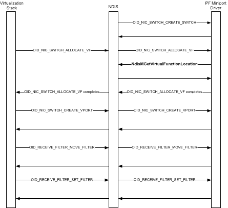

# Virtual Function Initialization Sequence

A network adapter that supports single root I/O virtualization (SR-IOV) must be able to support the following hardware components:

-   One PCI Express (PCIe) Physical Function (PF). The PF always exists on the network adapter and is attached to the Hyper-V parent partition.

    For more information on this hardware component, see [SR-IOV Physical Function (PF)](sr-iov-physical-function--pf-.md).

-   One or more PCIe Virtual Functions (VF). Each VF must be initialized and attached to a Hyper-V child partition before the networking components of the guest operating system can send or receive packets over the VF.

    For more information on this hardware component, see [SR-IOV Virtual Functions (VFs)](sr-iov-virtual-functions--vfs-.md).

The PF miniport driver, which runs in the management operating system of the Hyper-V parent partition, initializes and allocates resources for a VF on the SR-IOV network adapter. After NDIS calls the PF miniport driver’s [*MiniportInitializeEx*](https://msdn.microsoft.com/library/windows/hardware/ff559389) function, NDIS and the virtualization stack can issue object identifier (OID) requests to the PF miniport driver to do the following:

-   Create a NIC switch on the network adapter. The NIC switch bridges network traffic between the VFs, PF, and the physical network port.

    For more information, see [NIC Switches](nic-switches.md).

    **Note**  Starting with Windows Server 2012, the SR-IOV interface supports only one NIC switch on the network adapter. This switch is known as the *default NIC switch*, and is referenced by the NDIS\_DEFAULT\_SWITCH\_ID identifier.

-   Request the PF miniport driver to initialize and allocate resources for a VF on the network adapter.

    For more information, see [SR-IOV Virtual Functions (VFs)](sr-iov-virtual-functions--vfs-.md).

-   Create a virtual port (VPort) on the NIC switch and attach it to the VF.

    For more information, see [Virtual Ports (VPorts)](virtual-ports--vports-.md).

The following diagram shows the steps that are involved with VF initialization.

NDIS, the virtualization stack, and the PF miniport driver follow these steps during the VF initialization sequence:

1.  NDIS reads the default switch configuration from the registry and issues an OID method request of [OID\_NIC\_SWITCH\_CREATE\_SWITCH](https://msdn.microsoft.com/library/windows/hardware/hh451815) to provision the switch in the network adapter. The parameters that are passed in this OID request include information on how to configure important hardware resources such as VFs and VPorts. It also includes information on how to distribute the resources among the nondefault VPorts and the default VPort that are attached to the PF.

    After the OID has been successfully completed by the PF miniport driver, the NIC switch is ready to be used to create VPorts and allocate VFs on it.

    For more information on how to create a NIC switch, see [Creating a NIC Switch](creating-a-nic-switch.md).

2.  A VF is treated as an offload mechanism for the virtual machine (VM) network adapter. This adapter is exposed in the guest operating system that runs in the Hyper-V child partition. By default, the networking components in the guest operating system send and receive packets over the software-based synthetic data path. However, if a child partition is enabled for VF offload, the virtualization stack issues OID requests to the PF miniport driver for the resource allocation and initialization of a VF. After the VF is attached to the child partition and a VPort on the NIC switch, the networking components send and receive packets over the VF data path. For more information about these data paths, see [SR-IOV Data Paths](sr-iov-data-paths.md).

    If a Hyper-V child partition has been enabled for VF offload, the virtualization stack issues an OID method request of [OID\_NIC\_SWITCH\_ALLOCATE\_VF](https://msdn.microsoft.com/library/windows/hardware/hh451814) to the PF miniport driver. The parameters that are passed in this OID request include the identifier of the NIC switch on which the VF is allocated. Other parameters include identifiers for the child partition to which the VF will be attached.

    The PF miniport driver allocates the necessary hardware and software resources for the VF. The PF miniport driver also determines the PCIe Requestor Identifier (RID) for the VF by calling [**NdisMGetVirtualFunctionLocation**](https://msdn.microsoft.com/library/windows/hardware/hh451487). The RID is used for DMA and interrupt remapping when DMA requests and interrupts are generated by the VF.

    The RID along with the VF identifier are returned by the PF miniport driver when it successfully completes the [OID\_NIC\_SWITCH\_ALLOCATE\_VF](https://msdn.microsoft.com/library/windows/hardware/hh451814) request.

    For more information about resource allocation for a VF, see [Allocating Resources for a Virtual Function](allocating-resources-for-a-virtual-function.md).

3.  The virtualization stack creates a VPort on the NIC switch by issuing an OID method request of [OID\_NIC\_SWITCH\_CREATE\_VPORT](https://msdn.microsoft.com/library/windows/hardware/hh451816) to the PF miniport driver. The parameters that are passed in this OID request include the identifier of the NIC switch on which the VPort is to be created. Other parameters include the identifier of the VF to which the VPort will be attached.

    **Note**  The default VPort on the NIC switch always exists and is attached to the PF. Only a single nondefault VPort can be created and attached to a VF.

    Before NDIS forwards the OID request to the PF miniport driver, it allocates a valid VPort identifier that is unique over the network adapter.

    When the PF miniport driver handles the OID request, it allocates the hardware resources required for the VPort and retains the identifier for the VPort. This identifier is used in later OID requests and SR-IOV function calls.

    For more information about how to create a VPort, see [Creating a Virtual Port](creating-a-virtual-port.md).

4.  The Hyper-V child partition may be started long before a VF and VPort are allocated. During this time, the networking components in the guest operating system send and receive packets over the synthetic data path. This involves packet traffic over the default VPort that is attached to the PF. To bridge traffic to the child partition, the virtualization stack configures the default VPort with the media access control (MAC) and virtual LAN (VLAN) filters for the VM network adapter of the child partition.

    After resources for the VF and VPort are allocated, the virtualization stack issues an OID method request of [OID\_RECEIVE\_FILTER\_MOVE\_FILTER](https://msdn.microsoft.com/library/windows/hardware/hh451845) to the PF miniport driver. This OID request moves the MAC and VLAN filters for the VM network adapter from the default VPort to the VPort that is attached to the VF. This causes packets that match these filters to be forwarded to the VF VPort over the VF data path.

    **Note**  Existing receive filters may be moved from the default VPort to the VF VPort by using [OID\_RECEIVE\_FILTER\_MOVE\_FILTER](https://msdn.microsoft.com/library/windows/hardware/hh451845). Also, new filters may be set on the VF VPort by using [OID\_RECEIVE\_FILTER\_SET\_FILTER](https://msdn.microsoft.com/library/windows/hardware/ff569795).

After the VF and the VPort are created successfully and the MAC filters have been set on the VPort, the virtualization stack notifies the Virtual PCI (VPCI) virtual service provider (VSP). This VSP runs in the management operating system of the Hyper-V parent partition. The notification informs the VPCI VSP that the VF that has been successfully allocated and attached to a child partition. The VPCI VSP sends messages over the virtual machine bus (VMBus) to the VPCI virtual service client (VSC) that runs in the guest operating system of the child partition. The VPCI VSC is a bus driver that exposes a PCI device for the VF network adapter.

After the VF network adapter is exposed, the PnP subsystem that runs in the guest operating system detects the adapter and loads the VF miniport driver. This driver registers with NDIS. After the VF miniport driver has been initialized and the appropriate packet filters are configured on the VF network adapter, the VF data path is fully operational. As a result, packet traffic in the guest operating system switched to this data path from the synthetic data path.