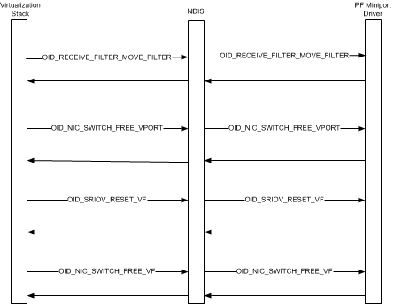

# Virtual Function Teardown Sequence

A network adapter that supports single root I/O virtualization (SR-IOV) must be able to support the following hardware components:

-   One PCI Express (PCIe) Physical Function (PF). The PF always exists on the network adapter and is attached to the Hyper-V parent partition.

    For more information on this hardware component, see [SR-IOV Physical Function (PF)](sr-iov-physical-function--pf-.md).

-   One or more PCIe Virtual Functions (VF). Each VF must be initialized and attached to a Hyper-V child partition before the networking components of the guest operating system can send or receive packets over the VF.

    For more information on this hardware component, see [SR-IOV Virtual Functions (VFs)](sr-iov-virtual-functions--vfs-.md).

Before the VF is torn down and its resources freed, the virtualization stack notifies the Virtual PCI (VPCI) virtual service provider (VSP). This VSP runs in the management operating system of the Hyper-V parent partition. The notification informs the VPCI VSP that the VF will be torn down and detached from the child partition. The VPCI VSP sends messages over the virtual machine bus (VMBus) to the VPCI virtual service client (VSC) that runs in the guest operating system of the child partition. These messages request the VPCI VSC to gracefully remove the VF network adapter that was exposed when the VF was attached to the child partition. This causes the NetVSC to unbind from the VF miniport driver and the driver to be halted. At this point, packet traffic in the child partition migrates from the VF data path to the software-based synthetic data path. For more information about these data paths, see [SR-IOV Data Paths](sr-iov-data-paths.md).

After the failover to the synthetic data path is complete, the VF is torn down and its resources freed. The following diagram shows the steps that are involved with VF teardown.

NDIS, the virtualization stack, and the PF miniport driver follow these steps during the VF teardown sequence:

1.  The virtualization stack moves the media access control (MAC) and virtual LAN (VLAN) filters for the virtual machine (VM) network adapter to the default virtual port (VPort) that is attached to the PF. The VM network adapter is exposed in the guest operating system of the child partition.

    Aftet the filters are moved to the default VPort, the synthetic data path is fully operational for network traffic to and from the networking components that run in the guest operating system. The PF miniport driver indicates received packets on the default PF VPort which uses the synthetic data path to indicate the packets to the guest operating system. Similarly, all transmitted packets from the guest operating system are routed through the synthetic data path and transmitted through the default PF VPort.

2.  The virtualization stack deletes the VPort that is attached to the VF by issuing an object identifier (OID) set request of [OID\_NIC\_SWITCH\_DELETE\_VPORT](https://msdn.microsoft.com/library/windows/hardware/hh451818) to the PF miniport driver. The miniport driver frees any hardware or software resources associated with the VPort and completes the OID request.

    For more information, see [Deleting a Virtual Port](deleting-a-virtual-port.md).

3.  The virtualization stack requests a PCIe function level reset (FLR) of the VF before its resources are deallocated. The stack does this by issuing an OID set request of [OID\_SRIOV\_RESET\_VF](https://msdn.microsoft.com/library/windows/hardware/hh451889)to the PF miniport driver. The FLR brings the VF on the SR-IOV network adapter into a quiescent state and clears any pending interrupt events for the VF.

4.  After the VF has been reset, the virtualization stack requests a deallocation of the VF resources by issuing an OID set request of [OID\_NIC\_SWITCH\_FREE\_VF](https://msdn.microsoft.com/library/windows/hardware/hh451822) to the PF miniport driver. This causes the miniport driver to free the hardware resources associated with the VF.

 

 

