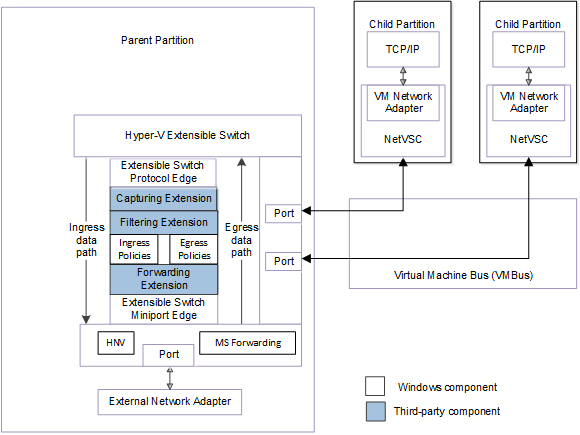
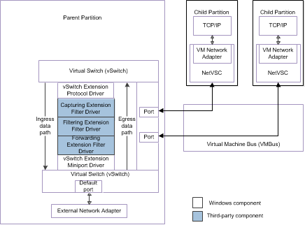

# Virtual Machine Network Adapters

The virtual machine (VM) network adapter is exposed in the guest operating system that runs in the Hyper-V child partition.

**Note**  In Hyper-V, a child partition is also known as a VM.

 

The VM network adapter supports the following virtualization types:

-   The VM network adapter could be a synthetic virtualization of a network adapter (*synthetic network adapter*). In this case, the network virtual service client (NetVSC) that runs in the VM exposes this virtual network adapter. NetVSC forwards packets to and from the extensible switch port over the VM bus (VMBus).

-   The VM network adapter could be an emulated virtualization of a physical network adapter (*emulated network adapter*). In this case, the VM network adapter mimics an Intel network adapter and uses hardware emulation to forward packets to and from the extensible switch port.

The following figure shows the interface between VM network adapters and the extensible switch NDIS 6.40 (Windows Server 2012 R2) and later.

The following figure shows the interface between VM network adapters and the extensible switch for NDIS 6.30 (Windows Server 2012).

The following steps occur when the user starts a Hyper-V VM:

1.  The protocol edge of the extensible switch issues an object identifier (OID) set request of [OID\_SWITCH\_PORT\_CREATE](https://msdn.microsoft.com/library/windows/hardware/hh598272) down the extensible switch driver stack. This OID request notifies the underlying extensible switch extensions that a port is being created for the VM.

2.  The protocol edge of the extensible switch issues an OID set request of [OID\_SWITCH\_NIC\_CREATE](https://msdn.microsoft.com/library/windows/hardware/hh598272) down the extensible switch driver stack. This OID request notifies the underlying extensible switch extensions that a network connection for the VM network adapter is being created for the VM port that was previously created.

3.  When the networking stacks are operational and have bound to the VM network adapter, the protocol edge of the extensible switch issues an OID set request of [OID\_SWITCH\_NIC\_CONNECT](https://msdn.microsoft.com/library/windows/hardware/hh598272) down the extensible switch driver stack. This OID request notifies the underlying extensible switch extensions that a network connection for the VM network adapter is connected and operational. At this point, the extension can inspect, inject, and forward packets to the port that is connected to the VM network adapter.

The following steps occur when the user stops a Hyper-V VM:

1.  The protocol edge of the extensible switch issues an OID set request of [OID\_SWITCH\_NIC\_DISCONNECT](https://msdn.microsoft.com/library/windows/hardware/hh598265) down the extensible switch driver stack. This OID request notifies the underlying extensible switch extensions that the connection to the VM network adapter is being torn down.

2.  After all packet traffic and OID requests that target the network connection are completed, the protocol edge of the extensible switch issues an OID set request of [OID\_SWITCH\_NIC\_DELETE](https://msdn.microsoft.com/library/windows/hardware/hh598272) down the extensible switch driver stack. This OID request notifies the underlying extensible switch extensions that the connection to the VM network adapter has been gracefully torn down and deleted.

3.  The protocol edge of the extensible switch issues an OID set request of [OID\_SWITCH\_PORT\_TEARDOWN](https://msdn.microsoft.com/library/windows/hardware/hh598279) down the extensible switch driver stack. This OID request notifies the underlying extensible switch extensions that the port that was used for the VM network adapter connection is being torn down.

4.  The protocol edge of the extensible switch issues an OID set request of [OID\_SWITCH\_PORT\_DELETE](https://msdn.microsoft.com/library/windows/hardware/hh598273) down the extensible switch driver stack. This OID request notifies the underlying extensible switch extensions that the VM port has been torn down and deleted.

 

 

