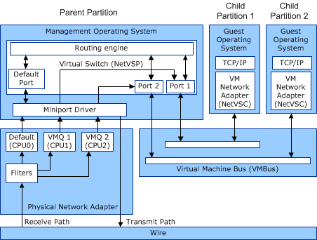

# Virtual Machine Queue (VMQ) Interface

A network adapter that supports the VMQ interface includes hardware that routes packets to receive queues. This requires parsing of the packet header and configuration of the queues on the network adapter.

When a miniport driver makes a receive indication, all of the packets are for the same VM queue.

As an option, the network adapter can provide VLAN filtering in hardware for a specified media access control (MAC) address.

Routing the packets to queues and indicating all the packets on a queue to a VM allows concurrent receive processing for multiple VMs. Every queue is serviced by a different processor.

Routing to queues in the network adapter prevents a copy step to copy data from the network adapter receive buffers to the VM address space.

The following figure shows the synthetic data paths within the VMQ interface.

In the figure, the miniport driver for the physical network adapter indicates received data up to the Hyper-V extensible switch component. This component acts as a network virtual service provider (NetVSP) and provides services to support networking access by the Hyper-V child partitions.

The services that the extensible switch provides includes routing packets to and from the virtual machine (VM) network adapters in the guest operating systems. The VM network adapter is exposed by the network virtual service client (NetVSC) that runs in the guest operating system.

Under VMQ, the physical network adapter transfers the data that matches a receive filter test for a VMQ directly to that queue. This prevents software processing in the extensible switch. Data that does not pass any filter tests goes to the default queue where the extensible switch must process the data. In addition to preventing the routing and copying in the extensible switch, the receive interrupts for VM queues are assigned to different processors.

For more information about the VMQ interface, see [Virtual Machine Queue (VMQ)](virtual-machine-queue--vmq-.md).

 

 

