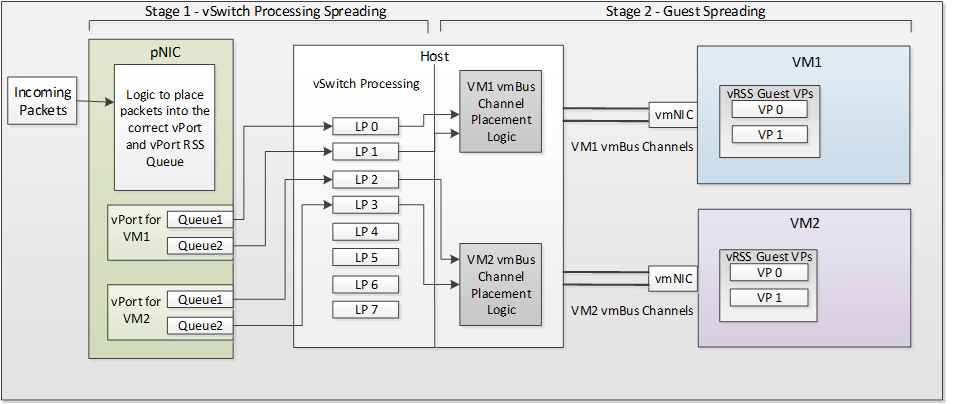

# VMMQ send and receive processing

[Virtual Machine Multiple Queues (VMMQ)](overview-of-virtual-machine-multiple-queues.md) efficiently distributes the network traffic for physical function [virtual ports](virtual-ports--vports-.md) (PF VPorts) using RSS processing. For more information on the [single root I/O virtualization (SR-IOV)](overview-of-single-root-i-o-virtualization--sr-iov-.md) interface and its components, see [SR-IOV Architecture](sr-iov-architecture.md).

The following figure shows the network packet receive path within the VMMQ interface.

On the receive path, when a packet arrives at a NIC that supports VMMQ the NIC:

1. Matches the destination MAC address to find the target VPort. 

1. Uses the [RSS parameters](/windows-hardware/drivers/ddi/ntddndis/ns-ntddndis-_ndis_receive_scale_parameters) of the VPort (the secret key, hash function, and hash type) to calculate the RSS hash value of the packet. 

1. Uses the hash value to index the indirection table associated with the VPort. The values in the indirection table are used to assign the received data to a processor.

1. Interrupts the target processor and the received packet is indicated to the host network stack. 

When indicating a received NBL, the miniport adapter sets the VPort ID and RSS related out-of-band (OOB) fields to the appropriate values.

On the transmit path, the NIC must use the RSS hash value in the packet (if present) as an index into the RSS indirection table for the VPort. The NIC uses this indirection table value to determine the processor that handles the transmit complete interrupts and DPCs for the packet.

If the NIC cannot calculate the RSS hash value of a received packet or the RSS hash value is not present in a transmit packet, it should use the default RSS processor of the VPort as the target RSS processor. The default RSS processor for a VPort will be specified in the RSS parameters for the VPort. For more information, see [Enabling, disabling, and updating VMMQ on a VPort](updating-vmmq-on-a-vport.md).

The host networking stack can update the RSS parameters of a VPort dynamically at runtime. The NIC should respond to the changes in the RSS parameters of a VPort with minimal interruption in traffic to and from the VPort.

