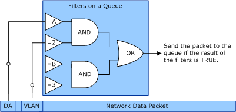

# VMQ Filter Operations

Multiple receive filters and can be set on a receive queue. Also, the current VMQ implementation supports filters on the destination media access control (MAC) address of the incoming packets and optional filters that inspect the virtual local area network (VLAN) identifier.

The following illustration shows the relationship between the VLAN identifier and MAC address tests, filters, and queues.

In the preceding illustration, the network data packet includes a destination address (DA) and VLAN identifier field. The network adapter hardware implements the filters on the queue based on the settings that the miniport driver received and set in the network adapter hardware. For more information about setting filters on a receive queue, see [Setting and Clearing VMQ Filters](setting-and-clearing-vmq-filters.md).

In this illustration, there are two filters; each filter compares a destination address and a VLAN identifier to the fields in the incoming packet. If both the VLAN and DA tests match, then the criterion for that filter is met and the incoming packet is assigned to the queue. If there is more than one filter on the queue and then a match for any filter, then the network adapter assigns the packet to the queue.

 

 

