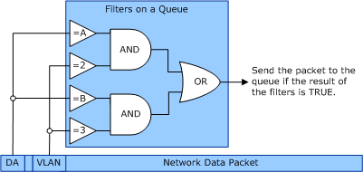

# VMQ Receive Filters

A network virtual service provider (VSP) sets VMQ receive filters on VMQ receive queues. Such a filter includes a set of network header field tests. The network adapter hardware performs these tests on header fields in incoming packets to determine the receive queue assignments for the packets. Each filter that is set on a queue has a unique filter identifier for a network adapter. That is, the filter identifiers are not duplicated on different queues that the network adapter manages.

The VMQ interface uses fields in the media access control (MAC) header in filter tests. Within the MAC header, VMQ filter tests use the virtual local area network (VLAN) identifier and the destination MAC address fields.

Multiple field tests can be specified in a receive filter. All of the tests must pass to match the criterion for the filter and assign a packet to a receive queue. VMQ filters test for fields that are equal to a specified value. For example, the destination MAC address is equal to a specified address.

Multiple filters can be set on a receive queue. If any of the filters on a queue match (that is, all of the tests for that filter were passed), the network adapter assigns the packet to that receive queue.

This following figure shows how filter tests are performed and how filters determine a queue assignment.

In the preceding figure, the destination address (DA) is tested (compared to A and B). Also, the VLAN identifier is tested (compared to 2 and 3). The AND operation illustrates that both the DA and VLAN identifier must be equal to the specified values to have a filter match. The OR operation illustrates that any filter on the queue that matches results in the assignment of the network data packet to that queue.

This following figure shows how filters and queues affect the receive data flow.

If an incoming packet matches a filter on a queue, it is assigned to that queue. Otherwise, the packet is tested against the filters on the next queue and so on. If there is no filter match on any of the queues, the network adapter assigns the packet to the default queue.

 

 

