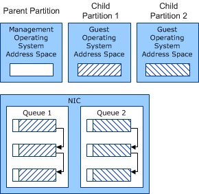

# VMQ Receive Queues

A virtual machine queue (VMQ) service provider allocates VMQ receive queues. The network adapter hardware assigns an incoming network data packet to a queue if the packet passes the filter tests that are set on the queue.

A VMQ receive queue has the following properties:

-   A queue identifier that is unique to the associated network adapter.

-   Processor affinity for interrupts.

-   Filters that are set on the queue.

-   Receive buffers that are assigned to the queue.

There is also a default queue that has the following properties:

-   The default queue always exists. Other queues must be allocated.

-   The default queue receives packets that do not pass the filter tests for the other queues.

Miniport drivers allocate shared memory for the receive buffers that are associated with a VMQ. Depending on the Windows Server version, miniport drivers must follow guidelines for buffer allocation that are described in the following sections:

-   [Allocating Shared Memory for VMQ Receive Buffers (Windows Server 2008 R2)](#windows7)

-   [Allocating Shared Memory for VMQ Receive Buffers (Windows Server 2012 and Later Versions)](#windows8)

VMQ shared memory requirements are designed to address potential security issues for virtual machines (VMs). For more information about VMQ security issues, see [Security Issues with NDIS Virtual Machine (VM) Shared Memory](security-issues-with-ndis-virtual-machine--vm--shared-memory.md).

### Allocating Shared Memory for VMQ Receive Buffers (Windows Server 2008 R2)

For NDIS 6.20 in Windows Server 2008 R2, if the miniport driver supports splitting packet data into separate lookahead buffers, it can allocate shared memory in the following way:

-   The miniport driver allocates the shared memory for the pre-lookahead buffer from the address space of the management operating system that runs in a Hyper-V parent partition. The pre-lookahead buffer is the part of the packet that is inspected by the management operating system.

-   The miniport driver allocates the shared memory for the post-lookahead buffer from the address space of the guest operating system that runs in a Hyper-V child partition. The post-lookahead buffer is the part of the packet that is inspected by the guest operating system.

    **Note**  The Hyper-V child partition is also known as a VM.

     

The following figure shows the shared memory in the queues, the management operating system, and the guest operating systems.

In the figure, each packet in a queue is shown with header information that was allocated from the management operating system address space and data that was allocated from the guest operating system address space.

### Allocating Shared Memory for VMQ Receive Buffers (Windows Server 2012 and Later Versions)

Starting with NDIS 6.30, splitting VMQ receive buffers into separate lookahead buffers is no longer supported. The miniport driver must allocate memory for each receive buffer from the address space of the management operating system.

 

 

