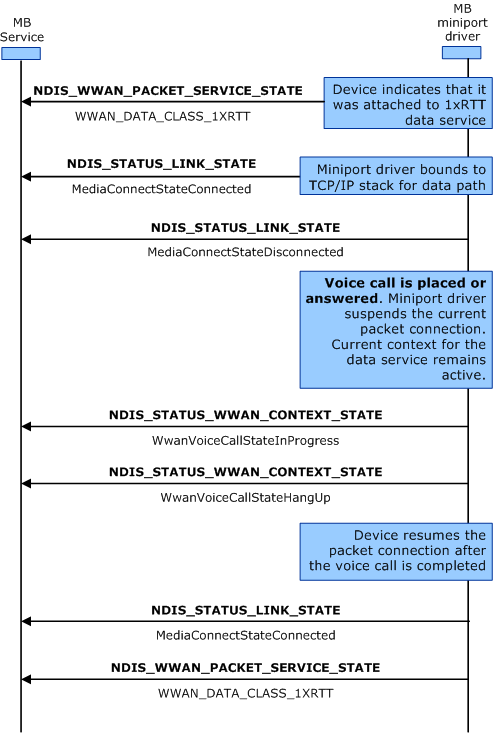

# Voice Calls during Packet Data Service Connections

The following diagram represents the process that miniport drivers should follow when a voice call is placed while packet data service is active. The diagram uses 1xRTT as an example, but the procedure applies to other air interfaces as well. The process outlined in the following graphic applies only to miniport drivers that return **WwanVoiceClassSeparateVoiceData** in the **WwanVoiceClass** member in response to an OID\_WWAN\_DEVICE\_CAPS *query* request. The labels in bold represent OID identifiers or transactional flow control, and the labels in regular text represent the important flags within the OID structure.

The procedure assumes that accepting an incoming voice call will pre-empt any pre-existing packet connection. For miniport drivers that return **WwanVoiceClassSimultaneousVoiceData** in the **WwanVoiceClass** member in response to an OID\_WWAN\_DEVICE\_CAPS *query* request, the current packet connection should not be affected.

Be aware that, by design, the MB Service does not support circuit voice, nor does it prohibit the service. The process outlined the following graphic applies only when the device can handle both data and circuit voice, but only one at a time. The process assumes that the voice call takes precedence over any potential pre-existing data connection. In this case, miniport drivers should suspend the data connection for the duration of the voice call. Afterwards, miniport drivers should resume the data service by re-establishing the MB connection automatically.

To handle voice calls during packet data service connections, use the following procedure:

1.  For a successful Packet Data service connection, miniport drivers should send an [**NDIS\_WWAN\_PACKET\_SERVICE\_STATE**](https://msdn.microsoft.com/library/windows/hardware/ff567910) notification to the MB service to indicate the current DataClass followed by an [**NDIS\_STATUS\_LINK\_STATE**](https://msdn.microsoft.com/library/windows/hardware/ff567391) notification to the MB service to indicate the media connect state as **MediaConnectStateConnected**.

2.  When a voice call is placed or answered, miniport drivers should send an [**NDIS\_STATUS\_LINK\_STATE**](https://msdn.microsoft.com/library/windows/hardware/ff567391) notification to the MB service to indicate the media connect state as **MediaConnectStateDisconnected**.

3.  Miniport drivers should then send an [**NDIS\_STATUS\_WWAN\_CONTEXT\_STATE**](https://msdn.microsoft.com/library/windows/hardware/ff567843) notification to the MB service that indicates the *VoiceCall* state of the device as **WwanVoiceCallStateInProgress**.

4.  On hangup, miniport drivers should send an NDIS\_STATUS\_WWAN\_CONTEXT\_STATE notification to the MB service that indicates the *VoiceCall* state of the device as **WwanVoiceCallStateHangup**.

5.  The device resumes packet connection after the voice call is completed. Miniport drivers should send an [**NDIS\_STATUS\_LINK\_STATE**](https://msdn.microsoft.com/library/windows/hardware/ff567391) notification to the MB service to indicate the media connect state as **MediaConnectStateConnected**.

6.  Miniport drivers should send an NDIS\_WWAN\_PACKET\_SERVICE\_STATE notification to the MB service that indicates the current DataClass.

 

 

