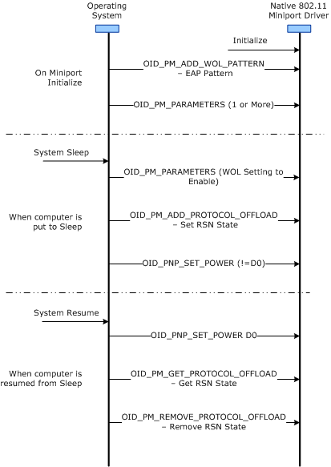

# Wake-on-Wireless LAN

**Important**  The [Native 802.11 Wireless LAN](native-802-11-wireless-lan4.md) interface is deprecated in Windows 10 and later. Please use the WLAN Device Driver Interface (WDI) instead. For more information about WDI, see [WLAN Universal Windows driver model](wifi-universal-driver-model.md).

 

## 

Beginning with NDIS 6.20, the operating system supports wake-on-Wireless-LAN operations. These operations reduce power consumption and are provided as part of the NDIS 6.20 power management interface. The NIC must be in Infrastructure Station mode and associated with an AP using either WPA2-Enterprise (WPA2) or WPA2-Personal (WPA2-PSK) authentication. In this configuration, while the computer is in a low-power state, the operating system lets the NIC handle Robust Security Network (RSN) group transient key (GTK) rekeying.

The following figure shows a typical wake-on-LAN (WOL) object identifier (OID) exchange sequence between the WiFi stack in the operating system and the 802.11 miniport driver.

### Supporting and Enabling Wake-on-LAN

The 802.11 miniport driver must report its support for WOL by doing the following:

1.  Support the **\*PMWiFiRekeyOffload** keyword in the [Standardized INF Keywords for Power Management](standardized-inf-keywords-for-power-management.md).

2.  Set the NDIS\_PM\_PROTOCOL\_OFFLOAD\_80211\_RSN\_REKEY\_SUPPORTED flag in the **SupportedProtocolOffloads** member of the [**NDIS\_PM\_CAPABILITIES**](https://msdn.microsoft.com/library/windows/hardware/ff566748) structure.

3.  Set the NDIS\_PM\_WOL\_EAPOL\_REQUEST\_ID\_MESSAGE\_SUPPORTED flag in the **SupportedWoLPacketPatterns** member of the [**NDIS\_PM\_CAPABILITIES**](https://msdn.microsoft.com/library/windows/hardware/ff566748) structure.

To enable WOL, the driver should do the following:

1.  Support the NDIS\_PM\_PROTOCOL\_OFFLOAD\_80211\_RSN\_REKEY\_ENABLED flag in the **EnabledProtocolOffloads** member of the [**NDIS\_PM\_PARAMETERS**](https://msdn.microsoft.com/library/windows/hardware/ff566759) structure.

2.  Support the \_PM\_WOL\_EAPOL\_REQUEST\_ID\_MESSAGE\_ENABLED flag in the **EnabledWoLPacketPatterns** member of the [**NDIS\_PM\_PARAMETERS**](https://msdn.microsoft.com/library/windows/hardware/ff566759) structure.

### IEEE 802.1X Authentication

Windows 7 does not support IEEE 802.1X authentication protocol offload. However, it can support a wake-up pattern for the IEEE 802.1X Extensible Authentication Protocol (EAP) Request Identity frame. When performing 802.1X EAP over LAN (EAPOL) frame matching, the NIC must ensure that the packet is directed to the NIC's current MAC address and the transmitter is the current access point (AP). Although the source media access control (MAC) address can be any valid address, for most implementations it will typically be the AP's MAC address.

### Infrastructure Assisted Wake Up

Some Native 802.11 implementations might rely on the infrastructure for supporting WOL events. The Native 802.11 miniport driver might cache the wake-up patterns locally. When the miniport driver handles the OIDs for adding or deleting wake-up patterns, it can update its local cache alone. The miniport driver can defer the update of the infrastructure network until it receives the OID set request of [OID\_PM\_PARAMETERS](https://msdn.microsoft.com/library/windows/hardware/ff569768).

The infrastructure network might not have enough resources to accommodate all of the wake-up patterns. In this case, the infrastructure network might accept a partial list of the wake-up patterns. When the miniport driver completes the [OID\_PM\_PARAMETERS](https://msdn.microsoft.com/library/windows/hardware/ff569768) request, it must issue [**NDIS\_STATUS\_PM\_WOL\_PATTERN\_REJECTED**](https://msdn.microsoft.com/library/windows/hardware/ff567414) status indications for each of the packet patterns that the AP rejected.

Similar requirements also apply to protocol offloads. For example, a miniport driver might use the AP's proxy Address Resolution Protocol (ARP) to support an ARP offload.

The following topics describe more details about the support that an 802.11 NIC and miniport driver should provide for WOL:

[Wake-Up Events](wake-up-events.md)

[NIC Low-Power Activities](nic-low-power-activities.md)

[Resuming from Low Power State](resuming-from-low-power-state.md)

For more information about power management for NDIS 6.20 and later versions of NDIS, see [Power Management (NDIS 6.20 and Later)](https://msdn.microsoft.com/library/windows/hardware/hh205401).

 

 

