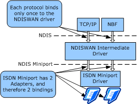

# WAN Driver Bindings and Connections

This topic provides an overview of bindings and connections between NDISWAN, overlying protocol drivers, and the underlying WAN miniport drivers.

### Bindings

NDISWAN binds to one or more WAN miniport drivers and one or more protocol drivers bind to NDISWAN.

The following figure illustrates the binding relationships between WAN client protocol drivers, NDISWAN, and WAN miniport drivers.

Protocol drivers bind once to NDISWAN and do not bind to WAN miniport drivers. This type of binding saves memory and simplifies WAN miniport drivers. Because there are typically several protocol drivers in a given system and there could be more than one WAN miniport driver, the reduction in the number of bindings saves memory. That is, each protocol does not have to bind to each WAN miniport driver. Also, because protocol drivers can rely on only having a single WAN binding, these protocol drivers can be simplified.

### Connections

NDIS WAN and CoNDIS WAN miniport drivers implement different models for connections:

-   An NDIS WAN miniport driver uses links to send and receive data. Links are logical, point-to-point bidirectional communication channels. There can be many links per NIC. Links are dynamically established and torn down. The link speed and quality of the link can vary for each connection. However, the padding and link parameters must be the same for all links that a NIC supports. For example, if an NDIS WAN miniport driver specifies a 20-byte header padding and 4-byte tail padding, this padding must remain constant for all links that the miniport driver's NIC supports.

-   A CoNDIS WAN miniport driver sends and receives data over virtual connections (VCs). There can be many VCs per NIC. While the data transmission speed can vary from VC to VC, the other VC parameters are the same for all VCs that the NIC supports. A CoNDIS WAN miniport driver can specify a maximum frame size for any net packet that the miniport driver can send and receive. If the miniport driver specifies a maximum frame size, that maximum frame size must remain constant for all VCs on that NIC.

Like other miniport drivers, every WAN miniport driver must have at least one NIC for which it allocates and maintains a NIC-specific context area. The NIC-specific context area is simply a way to store, retrieve, and use information about the hardware specifics of the NIC (such as interrupt, bus type, I/O range, and memory) and to maintain the run-time state for connections. A miniport driver should specify one NIC-specific context area for each network card in the system that it supports.

If a particular WAN miniport driver specifies that it does not require PPP address and control-field compression, it is assumed true for all connections on the miniport driver's NIC.

Before a WAN miniport driver can send or receive packets on a wide area network, a connection must be created:

-   In an NDIS environment, an application must set up a connection that originates on the sending node or accept a connection that originates on a remote node by making or accepting a call. The setup, supervision, and tear-down of a connection is done through TAPI. TAPI requests and status indications to TAPI all go through NDISTAPI. For more information about TAPI and NDISTAPI, see [NDISTAPI Overview](ndistapi-overview.md).

-   In a CoNDIS environment, a VC must be created. The NDPROXY driver creates a VC for an outgoing call that an application originated. Similarly, a call manager (or MCM) initiates the creation of a VC for an incoming call that the call manager indicates to NDISWAN and NDPROXY. The call manager must communicate and sometimes negotiate the parameters for the VC with the remote party. The setup, supervision, and tear-down of a connection is done through TAPI. TAPI requests and status indications to TAPI all go through NDPROXY. For more information about TAPI and NDPROXY, see [NDPROXY Overview](ndproxy-overview.md).

 

 

