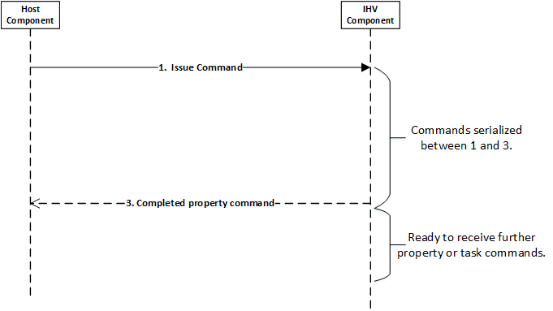

# Communication model, synchronization, and abort

At a high level, this documentation defines two types of objects:

1.  An adapter, which represents the Wi-Fi device.
2.  A port, which represents distinct MAC and PHY entities in the adapter.

For more information about these objects, see [Wi-Fi device model and objects](wdi-objects.md).
Commands, a set of permissible operations, are defined for each of these objects. Commands are further categorized into Properties and Tasks.

Property commands are simple commands (such as get signal strength, get current BSS list, and set packet filter). They complete in a short duration of time and are not complicated to implement.

Task commands are complex operations that may take several seconds to complete. For example, a Wi-Fi Scan operation would be categorized as a task in this model.

All commands issued to the IHV component can be completed asynchronously.

## Sequence of messages

The sequence of messages for each type of command is shown in the following figures.

Figure 1 shows the task command sequence.

Figure 2 shows the property command flow.

Figure 3 shows the flow for indications.

## Synchronization

To keep the IHV component implementation simple, the model defines the following synchronization rules:

1.  Commands are always serialized between Steps 1 and 3 in Figure 1 and Figure 2. For example, no new commands are issued to the adapter until the indication from the adapter at Step 3. This also implies that all properties are serialized with each other.
2.  All task commands are serialized between Steps 1 and 4 in Figure 1. For example, only one task runs on the adapter at a time. However, once a task is started (Step 3 in Figure 1), the adapter may get property command requests. Both Step 3 and Step 4 must finish before the next task command is sent.
3.  Property set commands are of two types – those that can be sent after the task has started, and those that must be serialized with pending tasks.
4.  Data path is not serialized with the command path, except for specific cases described later in the documentation.
5.  The synchronization scope is adapter level scope.
6.  A subset of tasks can be aborted after they have been started. This means that if a higher priority task (A) arrives while a lower priority task (B) is outstanding, B can be aborted by the host. Rationalization of prioritization decisions is beyond the scope of this documentation and is dependent on user scenarios.
7.  For task commands, Step 4 can come before Step 3 has completed. However, if Step 4 is indicated, Step 3 cannot fail.

## Abort

Most tasks can be aborted after they have been started. The purpose of the abort is to trigger the adapter to finish the task quickly by sending the complete indication (Step 4 in Figure 1). Abort is allowed only in the window between Steps 3 and 4 in Figure 1. On receiving the abort, the adapter must complete the task within 50 milliseconds. For most commands, upon receiving the abort, the adapter does not need to roll back to the state before the command was started. Race conditions exist between the abort command being issued and completions arriving to the host component. In this case, if the IHV component receives an abort for a task it has already completed, no further action is needed from the IHV component to process the abort operation. Aborting a task is simply a signal that the IHV component should clean up the task as soon as possible. Command completion semantics are not changed if an abort is issued. Both the completion for the abort property command, and the task completion indication must be appropriately notified in all cases.

Properties are expected to complete in short time so they cannot be aborted.

Task commands have a unique identifier that allows the host to target a specific command for abort.

 

 

