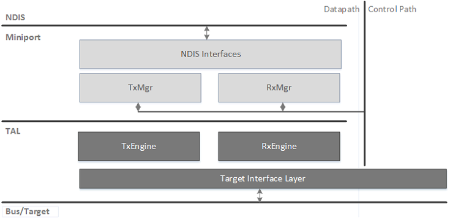

# WDI datapath architecture

To interoperate with existing WLAN target devices, the current version of the driver interface does not specify a host-controller interface (HCI) for TX/RX. Instead, it specifies a request/indication software interface between WDI and the Target Adaptation Layer (TAL).

The WDI component implements the NDIS datapath interfaces and the target-agnostic TX/RX functions performed by the host. It also maintains the state of individual virtual WLAN devices (ports) and peer-specific state.

The TAL provides the TX/RX WLAN functions for which the implementation depends on the host-controller interface, as well as the controller and bus interface functions.

In addition to the TX/RX function, the TAL provides a Target Interface Layer (TIL) that is used by the control and data paths. The responsibilities of the TIL are listed in the following table.

| TIL function                            | Description                                                                                                                                                                      |
|-----------------------------------------|----------------------------------------------------------------------------------------------------------------------------------------------------------------------------------|
| Management of Host-Target communication | Example: Allocate and manage the DMA channels required for control and data paths.                                                                                               |
| Bus adaptation/abstraction              | Provide a standard host/target communication API that abstracts the communication differences between different bus types, software/hardware bus endpoints, and bus DMA engines. |

 

 

 

