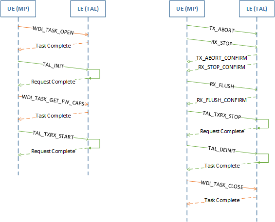
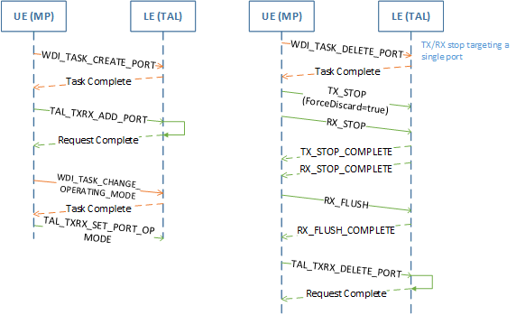
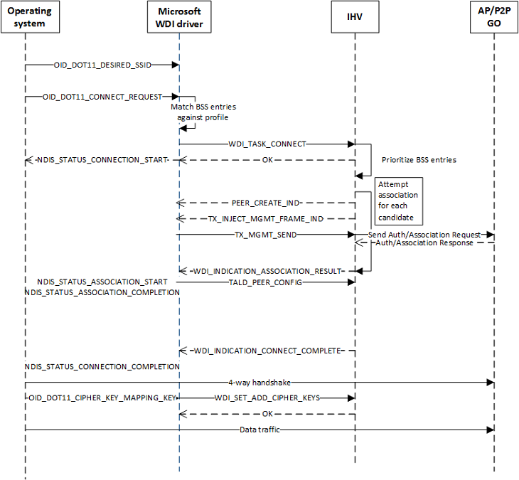
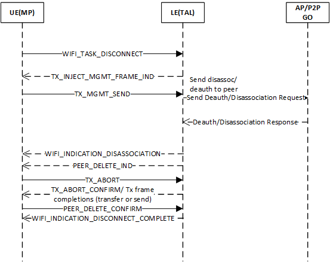

# WDI datapath operation sequence diagrams

Control path commands are shown in orange.

## Datapath initialization and deinitialization

## Datapath operations for port creation/deletion

## STA/Wi-Fi Direct client connect

## STA/Wi-Fi Direct client disconnect

 

 

