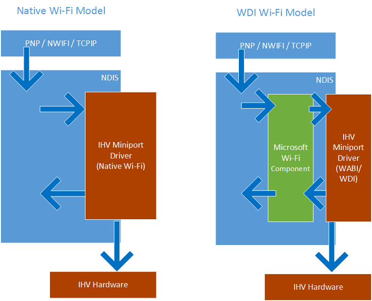

# WDI IHV component model

This section provides an overview of the NDIS interfaces for the WDI miniport driver and the expectations for those interfaces.

The IHV component in the WDI model is an NDIS miniport. It interfaces with the operating system and its networking stack using existing and new NDIS APIs. A Microsoft WLAN component sits between the WDI IHV miniport driver and the rest of the operating system. It provides a mapping between the WDI interfaces and the existing NDIS/Native WLAN interfaces. WDI commands are packaged as new NDIS OIDs and WDI indications are packaged as new NDIS indications. The data path interacts via [**NET\_BUFFER\_LIST**](https://msdn.microsoft.com/library/windows/hardware/ff568388) structures using new handlers.

The figure below shows the overall architecture layout and a sample flow of messages (PNP actions, OIDs, and sends) from the operating system to the IHV miniport driver for both the old Native WLAN model and the new WDI WLAN model.

Besides assisting with the Native Wi-Fi interface requirements, the Microsoft WLAN component also handles most of the common NDIS requirements. For example, it handles the [*MiniportPause*](https://msdn.microsoft.com/library/windows/hardware/ff559418) requirements from NDIS and converts them to WDI data and control path messages to ensure that NDIS requirements are met. However, it also provides the IHV miniport driver the ability to do additional work. The driver can register to be notified on *MiniportPause* call to do any additional cleanup it wants to do during *MiniportPause*.

 

 

