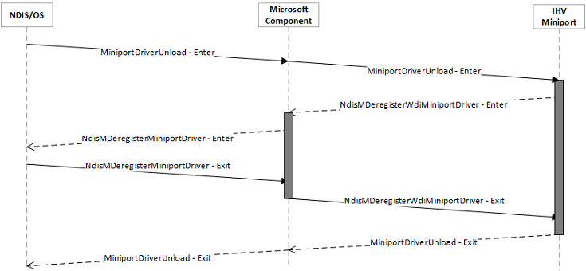
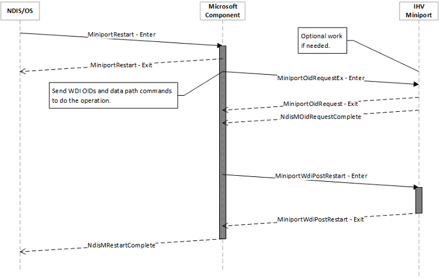

# WDI IHV driver interfaces

The WDI IHV miniport is like any other NDIS miniport driver and it would follow the development practices and documentation for any NDIS miniport. A Native WLAN Miniport driver’s responsibilities for the NDIS handlers are split between the MS Component and the WDI IHV driver. The Microsoft WLAN component takes care of the NDIS requirements that are applicable for all Wi-Fi miniports so that every IHV does not have to redo all that work. The mapping of and behavior changes for the NDIS handlers for the Native WLAN IHV miniport when applied to a WDI IHV miniport are described below.

-   [Driver installation](#driver-installation)
-   [DriverEntry](#driverentry)
-   [MiniportSetOptions](#miniportsetoptions)
-   [MiniportInitializeEx](#miniportinitializeex)
-   [MiniportHaltEx](#miniporthaltex)
-   [MiniportDriverUnload](#miniportdriverunload)
-   [MiniportPause](#miniportpause)
-   [MiniportRestart](#miniportrestart)
-   [MiniportResetEx](#miniportresetex)
-   [MiniportDevicePnPEventNotify](#miniportdevicepnpeventnotify)
-   [MiniportShutdownEx](#miniportshutdownex)
-   [MiniportOidRequest](#miniportoidrequest)
-   [MiniportCancelOidRequest](#miniportcanceloidrequest)
-   [NdisMIndicateStatusEx](#ndismindicatestatusex)
-   [MiniportDirectOidRequest](#miniportdirectoidrequest)
-   [MiniportCancelDirectOidRequest](#miniportcanceldirectoidrequest)
-   [MiniportSendNetBufferLists](#miniportsendnetbufferlists)
-   [MiniportCancelSend](#miniportcancelsend)
-   [MiniportReturnNetBufferLists](#miniportreturnnetbufferlists)
-   [WDI handler: MiniportWdiOpenAdapter](#wdi-handler-miniportwdiopenadapter)
-   [WDI handler: MiniportWdiCloseAdapter](#wdi-handler-miniportwdicloseadapter)

## Driver installation

There are no changes to the way the WDI IHV miniport driver is loaded and installed on the system. The INF and install process is similar to that of an IHV Native WLAN miniport driver. Like existing NDIS drivers, when the IHV driver needs to be loaded to work with the IHV's WLAN adapter, the operating system calls the IHV miniport driver's DriverEntry routine.

## DriverEntry

The operating system directly calls the WDI IHV miniport driver's DriverEntry routine. The IHV miniport follows most of the guidelines of a regular NDIS miniport's DriverEntry routine. The one exception is that instead of calling [**NdisMRegisterMiniportDriver**](https://msdn.microsoft.com/library/windows/hardware/ff563654), the IHV miniport calls [**NdisMRegisterWdiMiniportDriver**](https://msdn.microsoft.com/library/windows/hardware/mt297596) to tell the operating system to enable the Microsoft WLAN component.

The following are the key parameters of [**NdisMRegisterWdiMiniportDriver**](https://msdn.microsoft.com/library/windows/hardware/mt297596).

-   [**NDIS\_MINIPORT\_DRIVER\_CHARACTERISTICS**](https://msdn.microsoft.com/library/windows/hardware/ff565958): This is the original NDIS structure that a Native Wi-Fi miniport uses to register with NDIS. For a WDI model, most of the handler parameters are optional. The only required handlers are **MINIPORT\_OID\_REQUEST\_HANDLER** and **MINIPORT\_DRIVER\_UNLOAD**. **MINIPORT\_OID\_REQUEST\_HANDLER** is used to pass WDI messages to the IHV driver. If any other handler is specified, the Microsoft WLAN component generally calls the handler after it has performed its own processing for the handler.
-   [**NDIS\_MINIPORT\_DRIVER\_WDI\_CHARACTERISTICS**](https://msdn.microsoft.com/library/windows/hardware/mt297617): This is the new set of handlers that a WDI miniport driver must implement. It is used by the IHV driver to register additional handlers for the control path, and the full set of handlers for the data path.

When the IHV miniport calls NdisMRegisterWdiMiniportDriver, the Microsoft WLAN component updates the handlers of [**NDIS\_MINIPORT\_DRIVER\_CHARACTERISTICS**](https://msdn.microsoft.com/library/windows/hardware/ff565958) and call NDIS's [**NdisMRegisterMiniportDriver**](https://msdn.microsoft.com/library/windows/hardware/ff563654). The updates are done so that the Microsoft WLAN component can intercept the handlers for which it can provide assistance/simplification to the WDI IHV miniport driver.

Below is the typical flow of the DriverEntry process for the WDI IHV miniport driver

For more information about DriverEntry, see [**DriverEntry of NDIS Miniport Drivers**](https://msdn.microsoft.com/library/windows/hardware/ff548818).

## MiniportSetOptions

As shown in the above DriverEntry diagram, if the WDI IHV miniport has registered the [*MiniportSetOptions*](https://msdn.microsoft.com/library/windows/hardware/ff559443) handler, the operating system calls that function in the context of the miniport driver calling [**NdisMRegisterWdiMiniportDriver**](https://msdn.microsoft.com/library/windows/hardware/mt297596).

If the IHV miniport driver registers any option handlers using [**NdisSetOptionalHandlers**](https://msdn.microsoft.com/library/windows/hardware/ff564550), those handlers may not be serialized through the WDI layer by the Microsoft component. Therefore, the IHV component is responsible for handling any synchronization requirements for those handlers.

## MiniportInitializeEx

The WDI model splits the [*MiniportInitializeEx*](https://msdn.microsoft.com/library/windows/hardware/ff559389) behavior into multiple WDI interface calls.

1.  Call [*MiniportWdiAllocateAdapter*](https://msdn.microsoft.com/library/windows/hardware/mt297559).

    When the operating system finds an instance of the IHV hardware, this is the first call into the WDI IHV miniport driver. In this call, the WDI miniport performs the actions that are required to create a software representation (**MiniportAdapterContext**) of the device. It also determines information about the device to fill in the [**NDIS\_MINIPORT\_ADAPTER\_REGISTRATION\_ATTRIBUTES**](https://msdn.microsoft.com/library/windows/hardware/ff565934) structure. The actual initialization of the device and the Wi-Fi stack is done later when the Microsoft component sends WDI commands down to perform specific initializations.

    Using data obtained from the WDI IHV miniport driver, the Microsoft component calls [**NdisMSetMiniportAttributes**](https://msdn.microsoft.com/library/windows/hardware/ff563672) and sets the [**NDIS\_MINIPORT\_ADAPTER\_REGISTRATION\_ATTRIBUTES**](https://msdn.microsoft.com/library/windows/hardware/ff565934) on NDIS. Most fields of **NDIS\_MINIPORT\_ADAPTER\_REGISTRATION\_ATTRIBUTES** are filled with defaults by the Microsoft component. The IHV driver must populate the **MiniportAdapterContext** and **InterfaceType** fields.

    Once this call returns from the IHV miniport driver, it starts receiving WDI commands via its [*MiniportOidRequest*](https://msdn.microsoft.com/library/windows/hardware/ff559416) handler. During this call, the Microsoft component may not be able to perform reset/recovery operations, so any activity performed here should be quick and reliable.

2.  Call [*MiniportWdiOpenAdapter*](https://msdn.microsoft.com/library/windows/hardware/mt297564).

    After [*MiniportWdiAllocateAdapter*](https://msdn.microsoft.com/library/windows/hardware/mt297559), the Microsoft component calls [*MiniportWdiOpenAdapter*](https://msdn.microsoft.com/library/windows/hardware/mt297564) to load the firmware and initialize the hardware.

3.  Multiple WDI commands using [*MiniportOidRequest*](https://msdn.microsoft.com/library/windows/hardware/ff559416).

    After [*MiniportWdiOpenAdapter*](https://msdn.microsoft.com/library/windows/hardware/mt297564), the Microsoft component sends the following tasks/properties/calls to the IHV miniport.

    1.  Call [*MiniportWdiTalTxRxInitialize*](https://msdn.microsoft.com/library/windows/hardware/mt297580) to initialize the data path and exchange handlers.
    2.  Call [OID\_WDI\_GET\_ADAPTER\_CAPABILITIES](https://msdn.microsoft.com/library/windows/hardware/dn925838) to get the adapter’s capabilities.
    3.  Call [OID\_WDI\_SET\_ADAPTER\_CONFIGURATION](https://msdn.microsoft.com/library/windows/hardware/dn925853) to configure the adapter.
    4.  Call [OID\_WDI\_TASK\_SET\_RADIO\_STATE](https://msdn.microsoft.com/library/windows/hardware/dn925963) to set the initial radio state if it is not already in the expected state.
    5.  Call [*MiniportWdiTalTxRxStart*](https://msdn.microsoft.com/library/windows/hardware/mt297585) to set up the data path.
    6.  Call [OID\_WDI\_TASK\_CREATE\_PORT](https://msdn.microsoft.com/library/windows/hardware/dn925949) to create the initial port.

    Other commands may also be sent down to the IHV component as part of the MiniportInitializeEx processing of the Microsoft Component. However, until [*MiniportWdiStartOperation*](https://msdn.microsoft.com/library/windows/hardware/mt297575) is called, the Microsoft component does not send any tasks down that need over-the-air communication. Except for [OID\_WDI\_TASK\_OPEN](https://msdn.microsoft.com/library/windows/hardware/dn925954) always being sent first, the order of the other commands/calls may change.

    Using data obtained from the WDI IHV miniport driver, the Microsoft component calls [**NdisMSetMiniportAttributes**](https://msdn.microsoft.com/library/windows/hardware/ff563672) and sets [**NDIS\_MINIPORT\_ADAPTER\_GENERAL\_ATTRIBUTES**](https://msdn.microsoft.com/library/windows/hardware/ff565923) and [**NDIS\_MINIPORT\_ADAPTER\_NATIVE\_802\_11\_ATTRIBUTES**](https://msdn.microsoft.com/library/windows/hardware/ff565926) on NDIS.

4.  Call [*MiniportWdiStartOperation*](https://msdn.microsoft.com/library/windows/hardware/mt297575).

    This is an optional WDI miniport handler inside [**NDIS\_MINIPORT\_DRIVER\_WDI\_CHARACTERISTICS**](https://msdn.microsoft.com/library/windows/hardware/mt297617) that the IHV driver can use to perform any additional MiniportInitializeEx tasks. It can also be used by the IHV miniport as a hint that the Microsoft component has finished initializing the miniport and the miniport can start any needed background activities.

    The diagram below shows the flow of MiniportInitializeEx.

    

    If an intermediate operation fails, the Microsoft component undoes the previous operations and fails the miniport bring up. For example, if [OID\_WDI\_TASK\_CREATE\_PORT](https://msdn.microsoft.com/library/windows/hardware/dn925949) fails, the data path is cleaned up, [OID\_WDI\_TASK\_CLOSE](https://msdn.microsoft.com/library/windows/hardware/dn925947) is sent, and the miniport fails.

## MiniportHaltEx

In a Native Wi-Fi miniport, [*MiniportHaltEx*](https://msdn.microsoft.com/library/windows/hardware/ff559388) is used to tell the miniport to stop operations and clean up the adapter instance. In the WDI model, the Microsoft component handles the original *MiniportHaltEx* call and splits it into multiple WDI interface calls.

1.  Call [*MiniportWdiStopOperation*](https://msdn.microsoft.com/library/windows/hardware/mt297576).

    This is an optional WDI miniport handler inside [**NDIS\_MINIPORT\_DRIVER\_WDI\_CHARACTERISTICS**](https://msdn.microsoft.com/library/windows/hardware/mt297617) that the IHV driver can use to undo the operations it performed in [*MiniportWdiStartOperation*](https://msdn.microsoft.com/library/windows/hardware/mt297575).

2.  Multiple WDI Commands using [*MiniportOidRequest*](https://msdn.microsoft.com/library/windows/hardware/ff559416).

    After [*MiniportWdiStopOperation*](https://msdn.microsoft.com/library/windows/hardware/mt297576), the Microsoft component sends tasks/properties to the IHV miniport to clean up the current state of the IHV driver. This cleanup may include the following.

    1.  Call [OID\_WDI\_TASK\_DISCONNECT](https://msdn.microsoft.com/library/windows/hardware/dn925951)/[OID\_WDI\_TASK\_STOP\_AP](https://msdn.microsoft.com/library/windows/hardware/dn925965) to tear down any existing connections.
    2.  Call [OID\_WDI\_TASK\_DELETE\_PORT](https://msdn.microsoft.com/library/windows/hardware/dn925950) to delete all created ports.
    3.  Call [*MiniportWdiTalTxRxStop*](https://msdn.microsoft.com/library/windows/hardware/mt297586) to stop the data path.
    4.  Call [*MiniportWdiTalTxRxDeinitialize*](https://msdn.microsoft.com/library/windows/hardware/mt297578) to deinitialize the data path.
    5.  Call to clean up the hardware state. This is sent to the IHV using the [*MiniportWdiCloseAdapter*](https://msdn.microsoft.com/library/windows/hardware/mt297561) that has been registered by the IHV driver.

3.  Once all of the above commands are called, the Microsoft component calls [*MiniportWdiFreeAdapter*](https://msdn.microsoft.com/library/windows/hardware/mt297562) to have the IHV driver delete any software state it may have.

The diagram below shows the flow of MiniportHaltEx.

The MiniportHaltEx processing is not performed if the device is surprise removed or if the system is being powered off. For surprise removal, refer to the [MiniportDevicePnPEventNotify](#miniportdevicepnpeventnotify) handler behavior. For system shutdown, refer to the [MiniportShutdownEx](#miniportshutdownex) handler behavior.

## MiniportDriverUnload

[*MiniportDriverUnload*](https://msdn.microsoft.com/library/windows/hardware/ff559378) is the handler that is called before the WDI IHV miniport is unloaded. The WDI IHV miniport driver calls the Microsoft component to deregister itself. The Microsoft component calls [**NdisMDeregisterMiniportDriver**](https://msdn.microsoft.com/library/windows/hardware/ff563578).

The diagram below shows the flow of MiniportDriverUnload.

## MiniportPause

The NDIS [*MiniportPause*](https://msdn.microsoft.com/library/windows/hardware/ff559418) requirements are handled by the Microsoft component. As part of MiniportPause, the Microsoft component stops the data path and waits for it to clean up. The WDI IHV miniport can optionally register for a [*MiniportWdiPostAdapterPause*](https://msdn.microsoft.com/library/windows/hardware/mt297565) callback that is called by the Microsoft component after it finishes the data path cleanup.

The diagram below shows the flow of MiniportPause.

## MiniportRestart

The NDIS [*MiniportRestart*](https://msdn.microsoft.com/library/windows/hardware/ff559435) requirements are handled by the Microsoft component. As part of MiniportRestart, the Microsoft component undoes the data path pause work that it performed as part of MiniportPause. The WDI IHV miniport can optionally register for a [*MiniportWdiPostAdapterRestart*](https://msdn.microsoft.com/library/windows/hardware/mt297566) callback that is called by the Microsoft component after it finishes restarting the data path.

The diagram below shows the flow of MiniportRestart.

## MiniportResetEx

[*MiniportResetEx*](https://msdn.microsoft.com/library/windows/hardware/ff559432) is not handled by the Microsoft component. The WDI IHV miniport can optionally register for a *MiniportResetEx* callback that is called by the Microsoft component.

## MiniportDevicePnPEventNotify

[*MiniportDevicePnPEventNotify*](https://msdn.microsoft.com/library/windows/hardware/ff559369) is used to notify an NDIS driver of PNP events such as a device's surprise removal. When NDIS sends this notification, it is first forwarded to the WDI IHV miniport for processing. After the IHV component has finished processing it, the Microsoft component performs the appropriate processing for this event. The call that is forwarded into the IHV component is not serialized with other tasks and callbacks.

The diagram below shows the flow of MiniportDevicePnPEventNotify.

## MiniportShutdownEx

[*MiniportShutdownEx*](https://msdn.microsoft.com/library/windows/hardware/ff559449) is used to notify an NDIS driver about system shutdown events. When NDIS sends this notification, it is first handled by the Microsoft component. After the Microsoft component finishes processing it, it passes the event to the WDI IHV miniport for processing.

The diagram below shows the flow of MiniportShutdownEx.

## MiniportOidRequest

The [*MiniportOidRequest*](https://msdn.microsoft.com/library/windows/hardware/ff559416) handler is a required handler that the WDI IHV miniport must implement. It is used by the Microsoft component to submit WDI commands to the IHV miniport. It is also used to forward OIDs that the Microsoft component does not handle to the IHV miniport.

The [*MiniportOidRequest*](https://msdn.microsoft.com/library/windows/hardware/ff559416) call into the WDI IHV miniport should be considered as the M1 message for a WDI command. The completion of the OID (either via [**NdisMOidRequestComplete**](https://msdn.microsoft.com/library/windows/hardware/ff563622) or via a return non-PENDING from *MiniportOidRequest*) should be considered as the M3 message for a WDI task/command.

For every WDI command, there are two potential fields where an NDIS\_STATUS code can be returned for the operation -- the status code from the [*MiniportOidRequest*](https://msdn.microsoft.com/library/windows/hardware/ff559416) call (or [**NdisMOidRequestComplete**](https://msdn.microsoft.com/library/windows/hardware/ff563622)), and the status code in the [**WDI\_MESSAGE\_HEADER**](https://msdn.microsoft.com/library/windows/hardware/dn926074) field (either on the OID completion or via [**NdisMIndicateStatusEx**](https://msdn.microsoft.com/library/windows/hardware/ff563600)). The Microsoft component always looks at the NDIS\_STATUS from the OID completion before it looks at the **WDI\_MESSAGE\_HEADERStatus** field. The expectations of the IHV component for WDI OID processing are as follows.

1.  WDI OIDs are submitted to the IHV component using an [**NDIS\_OID\_REQUEST**](https://msdn.microsoft.com/library/windows/hardware/ff566710)**RequestType** of **NdisRequestMethod**, and the corresponding message and message length are in the **DATA.METHOD\_INFORMATION.InformationBuffer** and **DATA.METHOD\_INFORMATION.InputBufferLength** fields respectively.
2.  The IHV component reports an error in the OID completion if there is an error while processing the command, and sets the Status field of the [**WDI\_MESSAGE\_HEADER**](https://msdn.microsoft.com/library/windows/hardware/dn926074) to non-success if it has a Wi-Fi level failure.
3.  For tasks and properties, the port number for the request is in the [**WDI\_MESSAGE\_HEADER**](https://msdn.microsoft.com/library/windows/hardware/dn926074)**PortId** field. The **PortNumber** in the [**NDIS\_OID\_REQUEST**](https://msdn.microsoft.com/library/windows/hardware/ff566710) is always set to 0.
4.  For completion of the OID, it is acceptable for the [*MiniportOidRequest*](https://msdn.microsoft.com/library/windows/hardware/ff559416) to return NDIS\_STATUS\_PENDING and complete the OID later (synchronously or asynchronously) with [**NdisMOidRequestComplete**](https://msdn.microsoft.com/library/windows/hardware/ff563622).
5.  If the IHV component completes the OID with NDIS\_STATUS\_SUCCESS, it must populate the **BytesWritten** field of the OID request with the appropriate number of bytes, including space for the [**WDI\_MESSAGE\_HEADER**](https://msdn.microsoft.com/library/windows/hardware/dn926074).
6.  If the IHV component does not have enough space in the **DATA.METHOD\_INFORMATION.OutputBufferLength** field to fill the response, it completes the OID with NDIS\_STATUS\_BUFFER\_TOO\_SHORT and populates the **DATA.METHOD\_INFORMATION.BytesNeeded** field. The Microsoft component may attempt to allocate a buffer of the requested size and submit a new request to the IHV.
7.  If it is a task, the task's M4 ([**NdisMIndicateStatusEx**](https://msdn.microsoft.com/library/windows/hardware/ff563600)) must only be indicated if the task was reported as started successfully -- OID completion is successful and the **Status** in the [**WDI\_MESSAGE\_HEADER**](https://msdn.microsoft.com/library/windows/hardware/dn926074) in OID completion was success.

The diagram below shows an example of an NDIS OID request that maps to a single WDI command. When the OID request is submitted by the operating system, the Microsoft component converts it to a WDI OID request and submits the WDI OID request to the IHV miniport. When the IHV miniport completes the OID, the Microsoft component appropriately completes the original OID request.

If the OriginalOidRequest maps to multiple WDI OidRequests and one of the WDI requests fails, the OriginalOidRequest also fails. If a subset of the intermediate operations already finished, the Microsoft component attempts to undo the operations that support clean up.

The diagram below shows an example of an NDIS OID request that is handled completed by the Microsoft component. When the OID request is submitted by the operating system, the Microsoft component processes and completes the OID. This OID is not passed to the WDI IHV miniport.

OIDs that are not understood by the Microsoft component are forwarded directly to the IHV component for processing.

The behavior of MiniportOidRequest is unchanged for the WDI IHV miniport driver (as compared to a Native Wi-Fi miniport). The calls are serialized and the IHV miniport can either complete it synchronously or asynchronously with a call to [**NdisMOidRequestComplete**](https://msdn.microsoft.com/library/windows/hardware/ff563622).

## MiniportCancelOidRequest

This is an optional handler that is used by a WDI IHV miniport that needs to handle OIDs that are not mapped to WDI messages. This handler is not used for any WDI OIDs. WDI OIDs must complete quickly and there is no need for the IHV miniport driver to attempt to cancel a pending OID. Cancellation of WDI tasks is handled using the appropriate cancel task OID request. For unmapped OIDs, the expected behavior is defined by NDIS.

## NdisMIndicateStatusEx

[**NdisMIndicateStatusEx**](https://msdn.microsoft.com/library/windows/hardware/ff563600) is used by the WDI IHV miniport to send indications to the Microsoft component. The indications may be unsolicited indications such as TKIP MIC failures, or solicited indications for the completion (M4) for a task.

The diagram below shows an example of a WDI indication that has a corresponding NDIS/Native Wi-Fi indication. When the indication is submitted by the IHV miniport to the Microsoft component, the Microsoft component converts it to an existing indication and forwards it to the operating system.

The diagram below shows an example of a WDI indication that has no corresponding NDIS/Native Wi-Fi indication. This is handled by the Microsoft component.

The diagram below shows an indication that is not recognized by the Microsoft component. The indication is forwarded as-is to the operating system.

The behavior of NdisMIndicateStatusEx is unchanged for the WDI IHV miniport driver (as compared to a Native Wi-Fi miniport).

## MiniportDirectOidRequest

This is an optional handler that is registered by a WDI IHV miniport driver if it needs to handle Direct OIDs that are not mapped to WDI messages. All existing Direct OIDs for Wi-Fi Direct are mapped to WDI messages, so this handler is not required to support that functionality. Unsupported Direct OIDs are not serialized by the Microsoft component.

## MiniportCancelDirectOidRequest

This is an optional handler that is used by a WDI IHV miniport that needs to handle Direct OIDs that are not mapped to WDI messages. For unmapped OIDs, the expected behavior is defined by NDIS.

## MiniportSendNetBufferLists

This handler is not used in a WDI IHV miniport driver and should not be provided. The Microsoft component uses the data path handlers registered through [**NDIS\_MINIPORT\_DRIVER\_WDI\_CHARACTERISTICS**](https://msdn.microsoft.com/library/windows/hardware/mt297617) to submit send packets to the IHV miniport.

## MiniportCancelSend

This handler is not used in a WDI IHV miniport driver and should not be provided.

## MiniportReturnNetBufferLists

This handler is not used in a WDI IHV Miniport driver and should not be provided. The Microsoft component uses the data path handlers registered through [**NDIS\_MINIPORT\_DRIVER\_WDI\_CHARACTERISTICS**](https://msdn.microsoft.com/library/windows/hardware/mt297617) to return received packets to the IHV miniport.

## WDI handler: MiniportWdiOpenAdapter

The [*MiniportWdiOpenAdapter*](https://msdn.microsoft.com/library/windows/hardware/mt297564) handler is used by the Microsoft component to initiate the Open Task operation on the IHV driver. This call must complete quickly and if the open operation has been successfully started, the IHV must return NDIS\_STATUS\_SUCCESS on this call and call the [**OpenAdapterComplete**](https://msdn.microsoft.com/library/windows/hardware/mt297602) handler that is passed into the [**NDIS\_WDI\_INIT\_PARAMETERS**](https://msdn.microsoft.com/library/windows/hardware/mt297621) parameter of [*MiniportWdiAllocateAdapter*](https://msdn.microsoft.com/library/windows/hardware/mt297559).

## WDI handler: MiniportWdiCloseAdapter

The [*MiniportWdiCloseAdapter*](https://msdn.microsoft.com/library/windows/hardware/mt297561) handler is used by the Microsoft component to initiate the Close Task operation on the IHV driver. This call must complete quickly and if the open operation has been successfully started, the IHV must return NDIS\_STATUS\_SUCCESS on this call and call the [**CloseAdapterComplete**](https://msdn.microsoft.com/library/windows/hardware/mt297598) handler that is passed into the [**NDIS\_WDI\_INIT\_PARAMETERS**](https://msdn.microsoft.com/library/windows/hardware/mt297621) parameter of the [*MiniportWdiAllocateAdapter*](https://msdn.microsoft.com/library/windows/hardware/mt297559).

 

 

