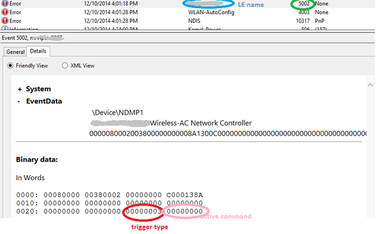

# WDI information collection for bugs


Bugs in any non-trivial software are inevitable. In the driver development phase, bugs and debugging activities are expected to be a non-trivial part of the endeavor. Bugs may require joint company efforts, as they can be in the operating system, WDI UE, or WDI LE. It is crucial to collect relevant information to quickly narrow in on root causes. The information to collect varies widely depending on the nature of the bugs. Iterations of reproduction of a bug to collect further information are sometimes necessary, but it is critical to reduce these iterations as much as possible. Here are some rules to start with.

## OS crash without kernel debugger attached


The operating system generates a crash dump. There are different types of crash dumps, such as mini-dumps and full dumps. While a mini-dump is small, it is often only good for triage. In order to root cause an issue, a full dump is almost always necessary. Enabling full dumps during the driver development and self-hosting phases is recommended. To enable full dumps:

1.  From the desktop, right-click on **This PC** and choose **Properties**.
2.  On the **Advanced** tab, go to the **Startup and Recovery** section and click on the **Settings...** button.
3.  In the **Write debugging information** section, choose **Kernel memory dump** (rather than **Automatic memory dump**).

When an operating system crash occurs, a memory dump file is generated at %windir%\\memory.dmp.
## OS crash with kernel debugger attached


Developers or QA should have kernel debuggers attached if possible. A kernel debugger can quickly tell what is wrong and which direction to investigate further. The kd command '[**!analyze**](https://msdn.microsoft.com/library/windows/hardware/ff562112) –v' is useful as the first command to run after a bug check. This command points to the location inside a module where the crash occurred and the reason (bug check code) for the crash.

## When Reset Recovery is invoked


The Reset Recovery feature of WDI builds in the ability to collect live kernel dumps when Reset Recovery is invoked. The kernel dump enables developers to investigate the root causes post-mortem. Live kernel dumps are collected under %windir%\\LiveKernelDumps.

### Reset Recovery triggers

The current Reset Recovery triggers are listed below. More triggers may be added in the future.

-   The UE detects a timeout of a WDI command (M3) sent to the LE.
-   The UE detects a timeout of a WDI task (M4) sent to the LE.
-   The LE detects and indicates a firmware hang.
-   User mode requests a Reset Recovery. This is currently only for loss of internet connectivity. When the NIC is connected and has internet connectivity, wlansvc starts the internet loss state machine. If internet connectivity is lost and not regained within 35 seconds, wlansvc requests that WDI initiates a Reset Recovery. The 35 second timeout is subject to change in the future.

### Events for Reset Recovery triggers

WDI calls NDIS to log an Error event to the system event log when it receives a Reset Recovery trigger. The event is in the LE name and the ID is 5002. The last two DWORDs are \[TriggerType, ActiveWdiCommand\]. The current trigger types are listed below.

-   COMMAND\_TIMER\_ELAPSED (1)
-   TASK\_TIMER\_ELAPSED (2)
-   RESET\_RECOVERY\_OID\_REQUEST (3)
-   RESET\_RECOVERY\_FIRMWARE\_STALLED (4)

ActiveWdiCommand may be 0 (no active command) if the trigger type is RESET\_RECOVERY\_OID\_REQUEST or RESET\_RECOVERY\_FIRMWARE\_STALLED.

This screenshot is an example view of eventvwr showing system.evtx. The trigger type is 3 and there is no active command.



## When Wi-Fi malfunctions


If there is no crash but Wi-Fi does not function as expected, collect and analyze a trace log. To see if the issue is confined to the WDI UE and LE, a wlan\_dbg trace should be included to see the operating system events for the context. Wlan\_dbg contains WPP events that require operating system private symbols. The original etl trace should be reserved and included in communication.

## Connected Standby issues


Sometimes, the Wi-Fi NIC does not go to low power (device\_power\_state\_Dx). Other times, the device wakes up frequently. A SleepStudy report is helpful in first level triage. SleepStudy events are always on, but only collected if CS sessions are longer than 10 minutes. The events are also persistent (for example, you can inspect the study postmortem). To generate a SleepStudy, run the following command line in an Administrator command prompt.

```CMD
Powercfg /SleepStudy
```

A report file named SleepStudy-report.html is generated. It should be opened outside %windiir%\\system. The report breaks down what modules are keeping the system out of very low power state (DRIPS). It can also further break down which components are keeping the Wi-Fi NIC up (out of Dx).

 

 


