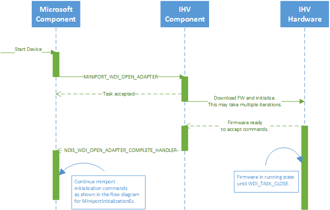

# Wi-Fi device initialization

This topic describes the initialization of the Wi-Fi device after power-on. On power-up, most Wi-Fi devices come up in an uninitialized mode. The Wi-Fi device does not have sufficient ROM to hold the firmware, so the IHV component/driver programs the device with firmware as part of device boot-up. The following diagram shows the initialization sequence in a bus/interconnect independent way.

1.  The IHV component is responsible for downloading the firmware to the adapter when the adapter is powered up. The exact mechanism to download the firmware is bus dependent. This operation is done in the context of the [*MiniportWdiOpenAdapter*](/windows-hardware/drivers/ddi/dot11wdi/nc-dot11wdi-miniport_wdi_open_adapter) call. This is an asynchronous operation. The host is responsible for ensuring that the adapter is fully initialized and ready to process commands before further commands are sent to it. The exact mechanism is interconnect dependent.
2.  Once the adapter is initialized, the host queries the adapter for various Wi-Fi properties, set properties, and creates ports (MACs) as part of miniport initialization.
3.  After the ports are created and initialized, the adapter can receive task and property commands.

 

