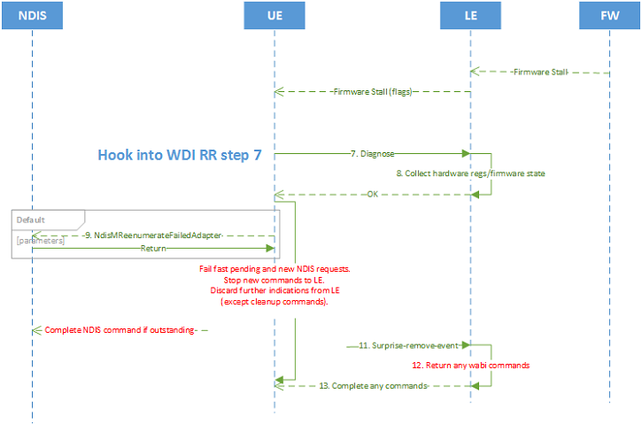
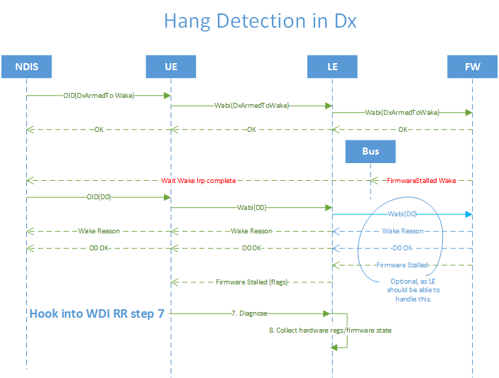

# LE hang detection

Some firmware have a watchdog timer that can detect firmware hangs. Some IHV drivers (LE) have logic to detect if the firmware is not making forward progress. The UE allows the LE to indicate such conditions.

The indication should be on the Adapter port (for example, portid=0xFFFF). By default, the indications trigger the LE to perform the full reset recovery procedure -- calling diagnose, collecting debug information, and requesting PLDR.

When the LE or firmware watchdog timer detects that the firmware stalled, the expectations from the UE are as follows.

1.  If in D0,
    1.  The LE indicates [NDIS\_STATUS\_WDI\_INDICATION\_FIRMWARE\_STALLED](https://msdn.microsoft.com/library/windows/hardware/dn925634).
    2.  At the return from the indication, the LE returns (if any) the stalled WDI command.
    3.  The UE starts the Reset Recovery (RR) procedure.

2.  If in Dx, this can only happen with firmware detected stall.
    1.  Firmware raises wake interrupt.
    2.  On receiving a D0 command, indicates the wake reason of why the firmware stalled.
    3.  After returning D0 WDI OID, the LE indicates [NDIS\_STATUS\_WDI\_INDICATION\_FIRMWARE\_STALLED](https://msdn.microsoft.com/library/windows/hardware/dn925634).
    4.  Finish the procedure as in D0: 1a, 1b, and 1c.

## Hang detection in Dx

It is possible that the firmware stops progress in Dx. In this case, Dx is D3Hot for PCIe NIC and D2 for USB and SDIO. The NIC is armed to wake and expected to maintain access point association autonomously, or scan NLO if not associated.

When the NIC is in Dx, the communication to the host is blocked because the bus could be in the power off state. Therefore, the LE is not able to detect stalled firmware. The firmware itself has to detect the condition and raise the wake line (if the wake portion of code is still alive) to bring the stack to D0, indirectly via ACPI or bus completing, NDIS wait\_wake\_irp. Due to this, NDIS sets D0 to the NIC.

The firmware asserts wake for such a condition. The LE should indicate a wake reason for the firmware stall. The wake reason **WDI\_WAKE\_REASON\_CODE\_FIRMWARE\_STALLED** is defined as an enum with the other wake reasons.

For Reset Recovery to work in this scenario, at least two portions of the firmware must still function.

1.  The hang detection code.
2.  The code to assert wake interrupt.

If there is a lack of either one, the Host side does not know if the firmware is stalled and RR does not happen. This scenario is not part of the design goal.

## OS module triggered reset recovery

This is informational for IHVs. In addition to UE and LE detected hangs, other OS components may detect hangs and/or trigger the UE to invoke the Reset Recovery procedure. Currently, the user mode wlansvc component in Windows 10 may request a Reset Recovery to UE when it detects a connection with Internet connectivity and subsequently loses the ability to access a DNS server without disassociation for some time. In the future, Microsoft may find additional cases to trigger a Reset Recovery to enhance end user experiences.

## Related topics

[NDIS\_STATUS\_WDI\_INDICATION\_FIRMWARE\_STALLED](https://msdn.microsoft.com/library/windows/hardware/dn925634)

[**WDI\_TLV\_INDICATION\_WAKE\_REASON**](https://msdn.microsoft.com/library/windows/hardware/dn897834)

 

 

