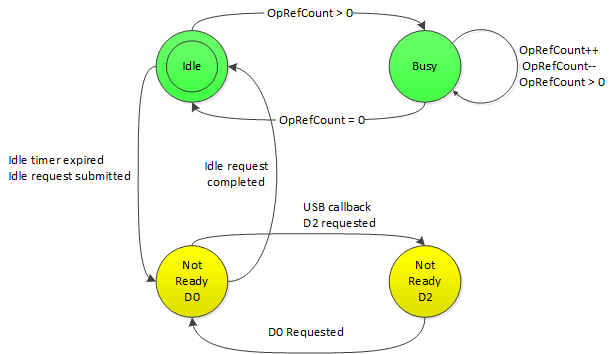

# WDI NDIS idle detection

This following diagram shows a simple state diagram of NDIS idle detection, which is used to drive USB selective suspend.

If the WDI device/driver supports USB selective suspend, NDIS detects its idle state to send the device into low power state (D2).

 

 

