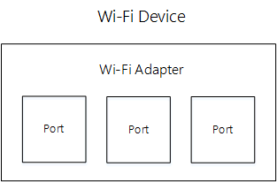

# Wi-Fi device model and objects

The Wi-Fi device is used by the host in the context of two types of objects: adapter and port.

## Adapter

The adapter object represents the Wi-Fi functionality in the Wi-Fi device. Commands and indications on this object are used to indicate state about the Wi-Fi interface. For systems with multiple Wi-Fi devices, each adapter object represents a different instance.

## Port

One Wi-Fi adapter can be used simultaneously for multiple connections e.g. Infrastructure client and Wi-Fi Direct group owner. The port object is used to represent the state associated with each such connection. Each port holds the MAC state for the connection and any phy state specific to that connection.

There can be multiple ports in an adapter. Commands issued on a port should only affect the state maintained for that port.

The operating system configures each port with an operation mode, such as 802.11 station, Wi-Fi Direct Client, or Wi-Fi Direct Group Owner. The set commands that the firmware must be prepared to handle on a given port are determined by the operation mode and the state of the port. A port can be in one of two states: INIT and OP. The port is initially in the INIT state and transitions to the OP state only when the operating system issues a command to connect (in the case of infrastructure client) or to start an AP/GO. The port returns to the INIT state when [OID\_WDI\_TASK\_DOT11\_RESET](https://msdn.microsoft.com/library/windows/hardware/dn925952) is sent to the IHV component.

## Port availability requirements

| Port type                        | Required count        |
|----------------------------------|-----------------------|
| Station Port                     | 1                     |
| Wi-Fi Direct Device              | 1 (if supported)      |
| Wi-Fi Direct Role (GO or Client) | 1 or 2 (if supported) |

 

## Port concurrency requirements

The following concurrency requirements for the different port types are as follows.

1.  1 Station Port is always available.
2.  1 Wi-Fi Direct Device port is always available.
3.  2 Wi-Fi Direct Role ports are available in the following configurations.
    1.  1 GO
    2.  1 Client
    3.  1 GO, 1 Client

 

 

