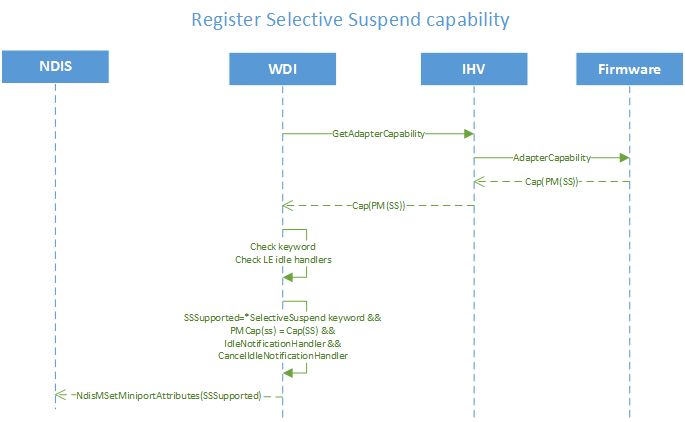

# WDI Selective Suspend capability registration

The following is a flow diagram for registering the USB Selective Suspend capability.

AdapterCap(PM(ss)), \*SelectiveSuspend, **LeIdleNotificationHandler**, and **LeCancelIdleNotificationHandler** must be true or valid for WDI to register that WLAN supports Selective Suspend.

When WDI decides that Selective Suspend can be supported, WDI also registers an optional handler to NDIS.

## Related topics

[*MiniportWdiCancelIdleNotification*](https://msdn.microsoft.com/library/windows/hardware/mt297560)

[*MiniportWdiIdleNotification*](https://msdn.microsoft.com/library/windows/hardware/mt297563)

 

 

