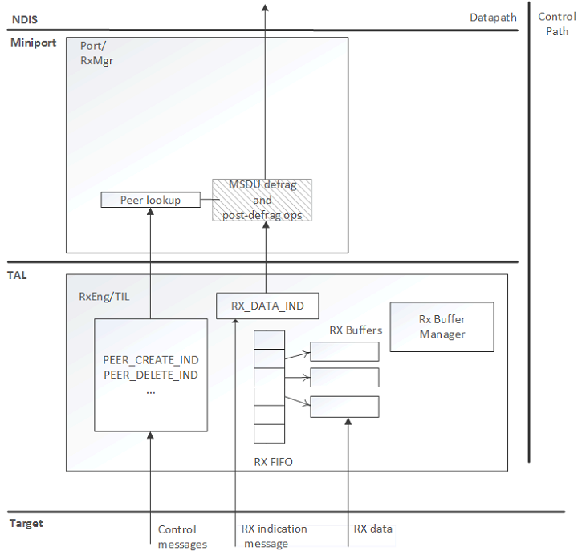

# WDI RX path

## RX path components

The following diagram shows the RX path components.

## RX Manager (RxMgr)

The RX Manager performs receive processing steps that are not offloaded to the target or performed by the RxEngine.

| RX function            | Description                                                                                                                                                                                     |
|------------------------|-------------------------------------------------------------------------------------------------------------------------------------------------------------------------------------------------|
| MSDU discard           | Discard MSDUs with errors.                                                                                                                                                                      |
| Queuing and throttling | Manage the DPC watchdog to prevent a bugcheck from too many indications per DPC, and too long at dispatch level. Provide backpressure to the RxEngine when appropriate to help with throttling. |

 

## RxEngine

The RxEngine sends and receives data-synchronous messages to and from the target, interprets RX descriptor formats, and manages buffers for direct hardware to software RX DMAs.

| RX function                             | Description                                                                                                                                                                                                                                              |
|-----------------------------------------|----------------------------------------------------------------------------------------------------------------------------------------------------------------------------------------------------------------------------------------------------------|
| Host-to-Target message construction     | Construct host-to-target data path-related messages.                                                                                                                                                                                                     |
| Target-to-Host message parsing          | Parse and process target-to-host data-synchronous messages such as [*NdisWdiRxInorderDataIndication*](/windows-hardware/drivers/ddi/dot11wdi/nc-dot11wdi-ndis_wdi_rx_inorder_data_ind).                                                                                                          |
| Interpretation of target RX descriptors | Provide an interface (functions) for querying RX frame attributes from the target-specific descriptor.                                                                                                                                                   |
| RX FIFO management                      | Provide a target-accessible FIFO for posting empty RX buffers for the target to fill. Remove buffers from the FIFO during [*NdisWdiRxInorderDataIndication*](/windows-hardware/drivers/ddi/dot11wdi/nc-dot11wdi-ndis_wdi_rx_inorder_data_ind) processing, and provide replacement empty buffers. |
| RX buffer pool management               | Maintain a pool of buffers for DMA transfer of receive frames.                                                                                                                                                                                           |
| MPDU discard                            | Discard MPDUs with errors. The target indicates the receive frames marked for discard - for example, due to FCS errors or ARQ duplication errors. This is only done if it is not implemented by the target.                                              |
| MPDU reorder                            | Store MPDUs in order within an RX reordering array until the missing preceding MPDUs arrive. This is only done if it is not implemented by the target.                                                                                                   |
| MPDU PN chk                             | This is only done if it is not offloaded to the target.                                                                                                                                                                                                  |
| MSDU Fragment Reassembly                | This is only done if it is not offloaded to the target.                                                                                                                                                                                                  |

 

## RX path requests and indications

For RX path request and indication function reference, see [WDI RX Path Functions](/windows-hardware/drivers/ddi/_netvista/).

## Related topics

[*NdisWdiRxInorderDataIndication*](/windows-hardware/drivers/ddi/dot11wdi/nc-dot11wdi-ndis_wdi_rx_inorder_data_ind)

[WDI RX Path Functions](/windows-hardware/drivers/ddi/_netvista/)

 

