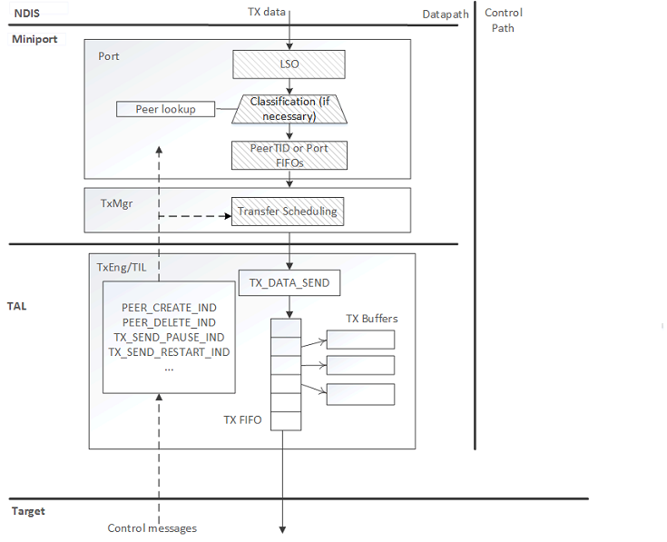

# WDI TX path

## TX path components

The following diagram shows the TX path components.

## TX descriptors

The TAL uses a Target TX Descriptor (TTD) to inform the target of the size and location of the frame.

Different target WLAN devices may have different definitions of the TTD. Due to this, the TTD programming is done within the TAL, based on information provided by WDI. To program a TTD, WDI specifies a [**NET\_BUFFER\_LIST**](https://msdn.microsoft.com/library/windows/hardware/ff568388) (NBL), through which the frame metadata, such as frame ID, extended TID, applicable task offloads, and encryption exemption action, is accessible.

The TAL transfers the TTD and the TX frame to the target. From the metadata in the TTD and fields within the frame's header, the target can determine the intended recipient of the transmit frame and how to transmit it.

Eventually, the target transmits the frame, and notifies the host when the transfer (and possibly transmission) is done. The target uses a TX completion message that specifies whether the transmission was successful, and the IDs of the frames whose transmission was completed.

## Basic operation

Transmitting a data frame involves the following steps within the WLAN host TX software.

1.  WDI obtains an NBL from NDIS and performs TX classification (if WDI is operating in PeerTID queuing mode).
2.  The NBL is linked to a TTD obtained by querying the TAL. For efficiency, the TAL may preallocate TTDs from a lookaside list.
3.  The TxMgr queues the transmit frame based on the PeerTID or Port, depending on the **TargetPriorityQueueing** mode.
4.  The TxMgr provides the NBL and the attached TTD to the TxEngine, which in turn passes it to the TIL for transfer to the target. The TxEngine/TIL does not queue frames (for example, prior to making them available for DMA).
5.  The TxEngine indicates the updated TX status of frames owned by the TxEngine/target using transfer completion (and transmit completion indication if applicable).
6.  When a frame is both Transfer Complete (and if required, TX Complete), the TxMgr looks up the NBL using the frame ID, returns the TTD to the TxEngine's pool, and send-completes the frame to NDIS.

## Host - target TX flow control

TX Flow control is necessary to avoid overwhelming the TIL and target resources.

### The target-credit scheme and the pause/resume mechanism

The TxMgr queues and transfers TX frames to the target according to a credit-based scheme. The target provides the TX Engine with credit-update indications that specify the resources available for additional frames on the target. The number of credits used up by each frame on the target is determined at the time of TTD programming. The number of frames passed to the TxEngine as part of a send operation from a given queue is limited by the available credits and the cost of the frames at the head of the line in FIFO order.

To the TxMgr, credits have an abstract unit. The Target/TxEngine should use whatever definition of credit is most useful to the specific implementation.

The TAL uses pause/resume indications to stop/resume the flow of TX traffic from a given port, or destined to a particular receiver with a given TID. If the TxEngine gets a send request while the available credit is less than the maximum frame cost, the TxEngine pauses the traffic from the TxMgr (across all ports) until the next credit update from the target.

When WDI is in port queuing mode (**TargetPriorityQueueing** equals TRUE), pause/resume indications are only allowed/defined at a port or adapter level due to the absence of Peer,TID classification, and queuing.

### Limiting the maximum frame count for send operations

To avoid the need for temporary queues in the TIL (for example, DMA rate matching queue), the number of frames that TxMgr passes to TxEngine in a send operation is limited by a maximum count specified by the TxEngine. This limit may be specific to the queue the TxMgr is attempting to send from and changes over time as more space is available in the TIL.

## Host - target TX transfer scheduling

The TxMgr uses a single TX thread to submit frames to the TxEngine. There is a TX thread actively submitting frames to the TxEngine as long as there are backlogged queues.

The TxMgr schedules queues in the following manner depending on the queuing mode.

For WDI port queuing (**TargetPriorityQueueing** equals TRUE), the TxMgr services queues using Deficit Round Robin (DRR) across all backlogged port queues.

For WDI PeerTID queuing (**TargetPriorityQueueing** equals FALSE), the TxMgr services queues according to AC priority without starving any queues, and ensures that any bottlenecked resources in TIL and target are shared among RA-TID streams in a fair manner. It prevents slow streams from consuming a disproportionate share of such resources.

In general, the scheduler uses DRR to choose the Peer-TID queue to transmit from at any given time. For each queue, DRR associates a quantum parameter that limits the number of octets to send from the queue in each round. The TxEngine updates this parameter in each send operation involving the queue to match the expected size of one or two transmission opportunities.

In general, the DRR scheduler services only the RA-TID queues associated with the backlogged AC of highest priority. To prevent starvation, the scheduler periodically performs DRR across all backlogged queues.

### Priority mapping for IHV reserved extended TIDs

Frames injected by the IHV with extended TID in the IHV reserved range map to the following extended ACs for the purposes of priority scheduling. The table is in order of increasing priority.

|              |        |        |        |        |         |         |         |         |
|--------------|--------|--------|--------|--------|---------|---------|---------|---------|
| Extended TID | 17     | 18     | 19     | 20     | 21      | 22      | 23      | 24      |
| Extended AC  | AC\_BK | AC\_BE | AC\_VI | AC\_VO | AC\_PR0 | AC\_PR1 | AC\_PR2 | AC\_PR3 |

 

For WDI port queuing, all injected frames are treated equally regardless of the extended TID.

## TxMgr-TxEngine interface

### Requests to TxEngine

-   [*MINIPORT\_WDI\_TX\_ABORT*](https://msdn.microsoft.com/library/windows/hardware/mt297587)
-   [*MINIPORT\_WDI\_TX\_DATA\_SEND*](https://msdn.microsoft.com/library/windows/hardware/mt297588)
-   [*MINIPORT\_WDI\_TX\_TAL\_QUEUE\_IN\_ORDER*](https://msdn.microsoft.com/library/windows/hardware/mt297590)
-   [*MINIPORT\_WDI\_TX\_TAL\_SEND*](https://msdn.microsoft.com/library/windows/hardware/mt297591)
-   [*MINIPORT\_WDI\_TX\_TAL\_SEND\_COMPLETE*](https://msdn.microsoft.com/library/windows/hardware/mt297592)
-   [*MINIPORT\_WDI\_TX\_TARGET\_DESC\_DEINIT*](https://msdn.microsoft.com/library/windows/hardware/mt297593)
-   [*MINIPORT\_WDI\_TX\_TARGET\_DESC\_INIT*](https://msdn.microsoft.com/library/windows/hardware/mt297594)

### Indications from TxEngine

-   [*NDIS\_WDI\_TX\_DEQUEUE\_IND*](https://msdn.microsoft.com/library/windows/hardware/mt297609)
-   [*NDIS\_WDI\_TX\_TRANSFER\_COMPLETE\_IND*](https://msdn.microsoft.com/library/windows/hardware/mt297616)
-   [*NDIS\_WDI\_TX\_SEND\_COMPLETE\_IND*](https://msdn.microsoft.com/library/windows/hardware/mt297613)
-   [*NDIS\_WDI\_TX\_QUERY\_RA\_TID\_STATE*](https://msdn.microsoft.com/library/windows/hardware/mt297611)

### TX specific control requests

-   [*MINIPORT\_WDI\_TX\_PEER\_BACKLOG*](https://msdn.microsoft.com/library/windows/hardware/mt297589)

### TX specific control indications

-   [*NDIS\_WDI\_TX\_SEND\_PAUSE\_IND*](https://msdn.microsoft.com/library/windows/hardware/mt297614)
-   [*NDIS\_WDI\_TX\_SEND\_RESTART\_IND*](https://msdn.microsoft.com/library/windows/hardware/mt297615)
-   [*NDIS\_WDI\_TX\_RELEASE\_FRAMES\_IND*](https://msdn.microsoft.com/library/windows/hardware/mt297612)
-   [*NDIS\_WDI\_TX\_INJECT\_FRAME\_IND*](https://msdn.microsoft.com/library/windows/hardware/mt297610)

## Related topics

[WDI TX Path Functions](https://msdn.microsoft.com/library/windows/hardware/mt269153)

[**NET\_BUFFER\_LIST**](https://msdn.microsoft.com/library/windows/hardware/ff568388)

[**WDI\_TXRX\_CAPABILITIES**](https://msdn.microsoft.com/library/windows/hardware/dn898187)

 

 

